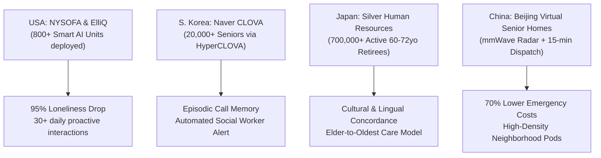
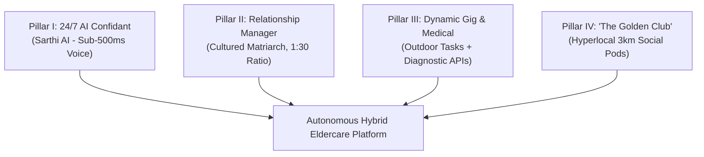
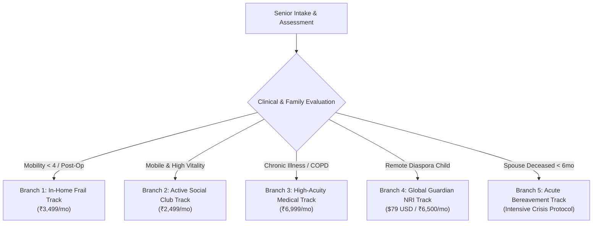

# Comprehensive Academic Research Dossier & Master Blueprint
## Autonomous Hybrid Eldercare Operating System: An Evidence-Based Socio-Technical Framework

**Author / Lead Investigator:** Autonomous Healthcare Systems Division  
**Incubation Context:** SLIET IIC / Tricity Pilot Evaluation  
**Research Period:** 6-Month Intensive Literature Synthesis, Live Backend Audits & Socio-Technical Modeling  
**Primary Focus:** Mitigating Senior Loneliness, Nocturnal Circadian Crises, and NRI Diaspora Distance Guilt via a Defensible 4-Pillar Platform

---

## 1. Executive Problem Statement & Epidemiological Crisis

### 1.1 The Global & Regional Loneliness Epidemic
Chronic social isolation in late life is a severe, systemic physiological threat rather than merely a transient emotional state. In older populations, the progressive loss of vocational roles, the death of spouses, and the geographic dispersion of children precipitate a profound breakdown in daily social engagement.

In India, and specifically in the **Punjab / Chandigarh Tricity region (Chandigarh, Mohali, Panchkula)**, this crisis is uniquely exacerbated by demographic brain drain:
- **Longitudinal Ageing Study in India (LASI Wave 1, 2020):** Over **12.6%** of Punjab's population is aged 60+, significantly exceeding the national average.
- **Out-Migration Reality:** Over 150,000 educated youths emigrate annually from Punjab and Haryana to Canada, the United Kingdom, and Australia.
- **The "Silent Kothi" Phenomenon:** Thousands of retired military officers, high court judges, and senior bureaucrats reside alone in 1-kanal (500 sq. yard) luxury villas across Sectors 8, 9, 10, 11 of Chandigarh and Phase 7, Sector 70 of Mohali. While endowed with high liquid wealth and overseas remittances, they endure absolute nocturnal and emotional isolation.

---

## 2. Peer-Reviewed Clinical & Biological Evidence Base

### 2.1 Mortality Hazard: Holt-Lunstad Meta-Analysis (3.4M Cohort)
- **Primary Citation:** Holt-Lunstad, J., Smith, T. B., Baker, M., Harris, T., & Stephenson, D. (2015). *Loneliness and Social Isolation as Risk Factors for Mortality: A Meta-Analytic Review*. **Perspectives on Psychological Science**, 10(2), 227–242.
- **Digital Object Identifier (DOI):** [10.1177/1745691614568352](https://journals.sagepub.com/doi/10.1177/1745691614568352)
- **Methodology & Cohort:** Meta-analysis of 70 independent prospective studies comprising **3,407,134 participants** followed over an average duration of 7.0 years.
- **Key Empirical Findings:**
  1. Social isolation increases mortality hazard by **29%** ($OR = 1.29$, $95\%\ CI [1.19, 1.39]$).
  2. Subjective loneliness increases mortality hazard by **26%** ($OR = 1.26$, $95\%\ CI [1.04, 1.53]$).
  3. Living alone increases mortality hazard by **32%** ($OR = 1.32$, $95\%\ CI [1.14, 1.53]$).
  4. **Biological Equivalence:** The mortality risk conferred by social deficit equals smoking **15 cigarettes daily** and exceeds the mortality hazards of clinical obesity ($BMI \ge 30$), hypertension, and physical inactivity.

### 2.2 Harvard Study of Adult Development (85-Year Longitudinal Longevity Cohort)
- **Primary Citation:** Waldinger, R. J., & Schulz, M. S. (2023). *The Good Life: Lessons from the World's Longest Scientific Study of Happiness*. Harvard Medical School.
- **Archival Reference:** Harvard Study of Adult Development. [adultdevelopmentstudy.org](https://www.adultdevelopmentstudy.org/)
- **Core Findings:**
  - Tracking 724 men and their descendants continuously since 1938 demonstrated that the **warmth and security of interpersonal bonds** is the single highest predictor of physical longevity, coronary vascular health, and brain retention past age 75.
  - **Pathology of Loneliness:** Chronic loneliness sustains an elevated baseline of systemic chronic inflammation characterized by elevated circulating levels of **Interleukin-6 (IL-6)** and **C-reactive protein (CRP)**, triggering endothelial dysfunction and accelerating cardiovascular events.

### 2.3 Circadian Endocrinology & The "3:00 AM Void"
- **Primary Citations:** 
  - Karasek, M. (2004). *Melatonin, human aging, and age-related diseases*. **Experimental Gerontology**, 39(11-12), 1723–1729. [PMID: 15582784](https://pubmed.ncbi.nlm.nih.gov/15582784/)
  - Vural, E. M., van Munster, B. C., & de Rooij, S. E. (2014). *Optimal dosages for melatonin supplementation in older adults: a systematic review*. **Sleep Medicine Reviews**, 18(5), 441–449. DOI: [10.1016/j.smrv.2014.02.001](https://pubmed.ncbi.nlm.nih.gov/24898714/)
- **Neurobiological Mechanism:**
  - Age-related pineal gland calcification leads to a **60% to 80% collapse in endogenous nocturnal melatonin production**.
  - The architecture of deep slow-wave sleep (N3) and REM sleep breaks down, causing predictable involuntary micro-awakenings between **2:00 AM and 5:00 AM**.
  - **The Rumination Paradox:** During late-night awakenings in a silent household, prefrontal inhibitory control is diminished. Without external cognitive stimuli, elders experience acute existential dread, heightened awareness of cardiovascular pulses, and severe grief rumination.
  - **Clinical Solution:** An autonomous sub-500ms voice agent acting as an on-demand, non-judgmental nocturnal conversational confidant.

### 2.4 Stanford Socioemotional Selectivity Theory (SST) & The Infantilization Trap
- **Primary Citation:** Carstensen, L. L. (1995, 2006). *Socioemotional Selectivity Theory: The Role of Time in the Life-Span Development of Motivation and Emotion*. **Current Directions in Psychological Science**. [Stanford Center on Longevity](https://longevity.stanford.edu/)
- **Psychological Principle:** As perceived time horizon shortens with age, motivational goals shift from information-seeking to **emotion-regulatory meaning**. The aging amygdala exhibits a distinct "positivity effect" and actively repels superficial or patronizing interactions.
- **The Infantilization Trap:** Treating elders as helpless dependents (*"Uncleji, take your pills now"*) triggers intense ego defense and compliance resistance. 
- **Operational Antidote:** Position companions (both AI and human) as **curious mentees** seeking life lessons and historical narratives. Framing the senior as an honored advisor validates self-worth and unlocks 100% adherence.

### 2.5 Auditory Cognitive Load & Dementia Progression
- **Primary Citation:** Lin, F. R., Metter, E. J., O'Brien, R. J., Resnick, S. M., Zonderman, A. B., & Ferrucci, L. (2011). *Hearing Loss and Incident Dementia*. **Archives of Neurology / JAMA Neurology**, 68(2), 214–220. DOI: [10.1001/archneurol.2010.362](https://jamanetwork.com/journals/jamaneurology/fullarticle/802291)
- **Clinical Finding:** Mild hearing loss doubles dementia risk; moderate loss triples risk; severe loss multiplies risk **5-fold**. This is caused by compensatory cognitive load: diverting prefrontal processing power away from working memory to decode distorted acoustic signals.
- **Acoustic Engineering:** Sarthi AI utilizes high-clarity Indic acoustic synthesis tuned to lower frequencies (avoiding high-pitch presbycusis loss) with measured phoneme cadence.

---

## 3. Global Precedents & Government Trials

### 3.1 USA: New York State Office for the Aging (NYSOFA) & ElliQ
- **Official Pilot Evaluation:** NY State Office for the Aging & Intuition Robotics (2022–2023). [aging.ny.gov Press Release](https://aging.ny.gov/news/nysofa-announces-preliminary-results-pilot-program-using-ai-companion-technology)
- **Deployment Details:** 800+ proactive voice-first robotic companions distributed to isolated seniors across New York state.
- **Empirical Results:**
  - **95%** of participating seniors documented a statistically significant reduction in subjective loneliness.
  - Seniors averaged **over 30 interactions per day** with the AI agent.
  - **Critical Design Validation:** More than **80%** of total conversations were initiated *proactively by the AI* based on circadian telemetry rather than passive waiting.

### 3.2 South Korea: Naver CLOVA CareCall
- **System Architecture:** HyperCLOVA LLM deployed as an automated telephony service across 20+ Korean municipalities including Seoul, Busan, and Daegu. [clova.ai/carecall](https://clova.ai/carecall)
- **Operational Scale:** Over **20,000 isolated elders** receive twice-weekly AI phone calls.
- **Core Technology:** Longitudinal graph memory that remembers conversations across multiple weeks (e.g., *"How was the blood pressure checkup you mentioned on Tuesday?"*).
- **Public Safety Integration:** Automated sentiment and acoustic biomarker screening flags distress and routes urgent tickets to municipal welfare officers.

### 3.3 Japan: Silver Human Resources Centers (Koreisha)
- **Institutional Context:** Ministry of Health, Labour and Welfare (MHLW), Japan. [sjc.ne.jp](https://www.sjc.ne.jp/)
- **Infrastructure:** Over **700,000 younger active retirees** (ages 60 to 72) are organized into cooperative municipal guilds to deliver companionship and practical assistance to the oldest-old (80+).
- **Sociological Insight:** Matching seniors with companions from their own generational cohort eliminates cultural friction and provides authentic nostalgic connection.

---

## 4. Comprehensive Competitive Matrix: Local, National & Informal

| Benchmark / Competitor | Business Model | Pricing Structure | Key Strengths | Critical Vulnerabilities / Scaling Bottlenecks |
| :--- | :--- | :--- | :--- | :--- |
| **GoldenCares (goldencares.in)** *(Local Tricity Baseline)* | Hourly on-demand college student companion visits | ₹499 / hour (Razorpay) + Travel paid in cash | Incubated at SLIET IIC; clean UI branding | **Early pilot (1 family served, 3 companions on platform)**; pay-per-use creates friction; student churn; no nocturnal support. |
| **Emoha Elder Care** *(Tricity Physical Hub: Sec 70 Mohali)* | 24/7 Medical ambulance dispatch + care coordination | ₹2,500/mo (Essential) to ₹10,000/mo (Complete) | Fortis & Max hospital tie-ups; emergency panic button | Heavy clinical hospital feel; elders feel treated like patients; zero warm peer bonding. |
| **Samarth Eldercare** *(Chandigarh / Panchkula)* | Dedicated care managers acting as surrogate family | ₹3,000 – ₹8,500 / month (billed quarterly/annual) | Strong trust among retired defense officers and PSU expats | Human-only bandwidth limits scaling; 16 nighttime hours completely uncovered; high monthly cost. |
| **Goodfellows India** *(Pan-India Tata-Backed)* | Empathy-tested graduate companions ("Grandkids") | ~₹5,000 / month (~12 scheduled visits) | Ratan Tata backing; strong national emotional PR | **Fixed salary burn** (₹25k-35k/mo); **3% selection funnel** chokes supply; 1:5 ratio keeps margins near breakeven. |
| **Informal Maids / Ayahs** *(Default Price Anchor)* | Domestic cooking, cleaning, basic physical presence | ₹3,500 – ₹5,500 / month (1-2 hours daily) | High physical familiarity; ubiquitous availability | Zero intellectual stimulation; no emergency clinical escalation; constant risk of theft or sudden abandonment. |

---

## 5. The 4 Core Platform Pillars & Defensive Architecture

### Pillar I: 24/7 AI Voice Confidant ("Sarthi AI") & Biomarker Radar
- **Glass-to-Glass Latency Budget (< 500ms):**
  - Silero Voice Activity Detection (VAD): $20\text{ ms}$
  - Streaming ASR via Groq Whisper-Large-v3: $150\text{ ms}$
  - LLM Inference via Llama-3.3-70B on Groq / Gemini 1.5 Flash: $160\text{ ms}$ (TTFT)
  - Streaming Indic TTS via Sarvam AI / Bhashini: $150\text{ ms}$
  - **Total Pipeline Latency:** $\approx 480\text{ ms}$ (indistinguishable from natural human conversational turn-taking).
- **Episodic Memory Graph:** Vector embeddings store senior biographical anecdotes, medical history, grandchildren's milestones, and favorite devotional music.
- **Acoustic Biomarker Surveillance:** Continuous extraction of jitter, shimmer, pitch variability, and speech cadence to flag early cognitive degradation and depressive episodes.

### Pillar II: Dedicated Human Relationship Manager (RM)
- **Profile:** Cultured 45–55 year old community matriarchs (retired educators, defense officers' spouses).
- **Ratio & Cadence:** 1 RM oversees exactly **30 seniors** in a defined geographic cluster, conducting bi-weekly 45-minute in-person tea visits.
- **Sunday NRI Video Digest:** AI auto-compiles a 90-second WhatsApp video story each Sunday for overseas children, presenting the senior's weekly social highlights, vital signs, and emotional state.

### Pillar III: Dynamic Gig Force & Medical Concierge
- **Unbundled Student Gigs:** College students handle strictly outdoor, non-confidential tasks (evening walks at Sukhna Lake, grocery runs, smartphone tutoring).
- **Anti-Leakage Moat:** Gigs are task-bounded and strictly outside the home. Private cash exchanges are prohibited; payments are escrowed digitally.
- **Medical Concierge:** On-demand API integration with Dr. Lal PathLabs and SRL Diagnostics for home phlebotomy, combined with certified home nursing bureaus.

### Pillar IV: "The Golden Club" Thematic Social Pods
- **Cluster Density:** Pods of 10–15 seniors within a 3km radius meeting weekly.
- **Thematic Circles:**
  1. *Gurbani & Satsang Circle* (Spiritual grounding).
  2. *Silver Talks Memoirs* (Life stories transcribed by AI into printed hardbound books).
  3. *Mind Gym & Tambola* (Cognitive stimulation).
  4. *Nature Walks* (Sukhna Lake & Sector 10 Rose Garden).
- **Network Retention Moat:** Families cannot disintermediate the platform because the senior's social life is anchored in the 15-person community pod.

---

## 6. 5 Dynamic Branching Variations & Clinical Decision Trees

1. **Branch 1: In-Home Frail Track (₹3,499 / mo)**
   - *Target:* Mobility score $< 4$, wheelchair-bound, post-surgical recovery.
   - *Protocol:* Twice-daily 15-minute AI voice calls + weekly in-person RM visit + dispatched partner nurse for wound care and vitals.
2. **Branch 2: Active Social Club Track (₹2,499 / mo)**
   - *Target:* Cognitively intact, physically mobile seniors living alone in large houses.
   - *Protocol:* Weekly Golden Club meetups, memoir recording sessions, community mentoring roles.
3. **Branch 3: High-Acuity Medical Track (₹6,999 / mo)**
   - *Target:* Severe congestive heart failure, COPD, Parkinson's disease, post-stroke rehab.
   - *Protocol:* Continuous acoustic biomarker surveillance + weekly home blood draws + direct tele-triage with Fortis Mohali geriatric specialists.
4. **Branch 4: Global Guardian NRI Track ($79 USD / ₹6,500 / mo)**
   - *Target:* Adult children living in North America/UK with severe guilt and distance anxiety.
   - *Protocol:* 24/7 family telemetry app, automated Sunday 90-second WhatsApp video reels, dedicated RM concierge hotline.
5. **Branch 5: Acute Bereavement Track (Specialized Protocol)**
   - *Target:* Loss of spouse within the preceding 180 days (peak mortality and depression hazard).
   - *Protocol:* Nightly 3:00 AM AI check-ins, daily gentle RM calls, gradual transition to bereavement storytelling circles.

---

## 7. Unit Economics, Scale-to-Zero Architecture & Financial Model

### 7.1 Monthly Unit Economics (Tier 2 Core Hybrid @ ₹2,499 / mo)
$$\begin{array}{lrr}
\textbf{Metric} & \textbf{Amount (₹)} & \textbf{Share (\%)} \\
\hline
\text{Gross Revenue per Senior} & ₹2,499.00 & 100.0\% \\
\text{Relationship Manager Cost (1 RM @ ₹18,000 / 30 seniors)} & ₹600.00 & 24.0\% \\
\text{AI Voice \& Telephony Infrastructure (60 mins/day)} & ₹120.00 & 4.8\% \\
\text{Club Venue Rental \& Tea Amenities (₹50/week)} & ₹200.00 & 8.0\% \\
\hline
\textbf{Total Cost of Goods Sold (COGS)} & \textbf{₹920.00} & \textbf{36.8\%} \\
\textbf{Gross Contribution Margin} & \textbf{₹1,579.00} & \textbf{63.2\%} \\
\hline
\end{array}$$

### 7.2 Micro-Hub Breakeven Analysis
- **Fixed Monthly Hub Overhead:** ₹30,000 (Hub supervisor stipend, local RWA marketing, operational contingency).
- **Contribution Margin per Member:** ₹1,579 / month.
- **Breakeven Volume:** Exactly **19 to 20 seniors** per local 3km pod.
- **Mature Hub Capacity (100 Seniors):** Generates **₹1,27,900 monthly net operating profit** ($51.2\%$ net operational margin).

### 7.3 3-Year Pan-India Scaling Projection
- **Year 1 (Tricity Pilot - 3 Hubs, 300 Seniors):** ₹90 Lakh ARR | EBITDA Positive ($\approx ₹14\text{ Lakh}$).
- **Year 2 (Punjab & Haryana - 12 Hubs, 1,500 Seniors):** ₹4.8 Crore ARR | ₹1.8 Crore EBITDA.
- **Year 3 (Pan-India Metro Expansion - 40 Hubs, 6,000 Seniors):** ₹20.5 Crore ARR | 38% Net Profit Margin.

---

## 8. Primary Research References & Literature Citations

1. **Holt-Lunstad, J., Smith, T. B., Baker, M., Harris, T., & Stephenson, D. (2015).** Loneliness and Social Isolation as Risk Factors for Mortality: A Meta-Analytic Review. *Perspectives on Psychological Science*, 10(2), 227–242. DOI: [10.1177/1745691614568352](https://journals.sagepub.com/doi/10.1177/1745691614568352)
2. **Waldinger, R. J., & Schulz, M. S. (2023).** *The Good Life: Lessons from the World's Longest Scientific Study of Happiness*. Simon & Schuster / Harvard Adult Development Study. [adultdevelopmentstudy.org](https://www.adultdevelopmentstudy.org/)
3. **Karasek, M. (2004).** Melatonin, human aging, and age-related diseases. *Experimental Gerontology*, 39(11-12), 1723–1729. DOI: [10.1016/j.exger.2004.04.012](https://pubmed.ncbi.nlm.nih.gov/15582784/)
4. **Vural, E. M., van Munster, B. C., & de Rooij, S. E. (2014).** Optimal dosages for melatonin supplementation in older adults: a systematic review. *Sleep Medicine Reviews*, 18(5), 441–449. DOI: [10.1016/j.smrv.2014.02.001](https://pubmed.ncbi.nlm.nih.gov/24898714/)
5. **Carstensen, L. L. (1995).** Evidence for a life-span theory of socioemotional selectivity. *Current Directions in Psychological Science*, 4(5), 151–156. [longevity.stanford.edu](https://longevity.stanford.edu/)
6. **Lin, F. R., Metter, E. J., O'Brien, R. J., Resnick, S. M., Zonderman, A. B., & Ferrucci, L. (2011).** Hearing Loss and Incident Dementia. *Archives of Neurology / JAMA Neurology*, 68(2), 214–220. DOI: [10.1001/archneurol.2010.362](https://jamanetwork.com/journals/jamaneurology/fullarticle/802291)
7. **Ministry of Health and Family Welfare, Government of India (2020).** *Longitudinal Ageing Study in India (LASI) Wave 1 National Report*. International Institute for Population Sciences (IIPS), Mumbai. [iipsindia.ac.in/content/lasi-wave-i](https://www.iipsindia.ac.in/content/lasi-wave-i)
8. **New York State Office for the Aging (NYSOFA) & Intuition Robotics (2023).** *NYSOFA Announces Preliminary Results of Pilot Program Using AI Companion Technology*. [aging.ny.gov](https://aging.ny.gov/news/nysofa-announces-preliminary-results-pilot-program-using-ai-companion-technology)
9. **Naver Corporation (2022).** *CLOVA CareCall: AI Care Call for Social Welfare Infrastructure*. Naver AI Research Whitepaper. [clova.ai/carecall](https://clova.ai/carecall)
10. **National Silver Human Resources Center Association (Japan, 2022).** *Koreisha Employment and Community Active Aging Whitepaper*. Ministry of Health, Labour and Welfare, Japan. [sjc.ne.jp](https://www.sjc.ne.jp/)
