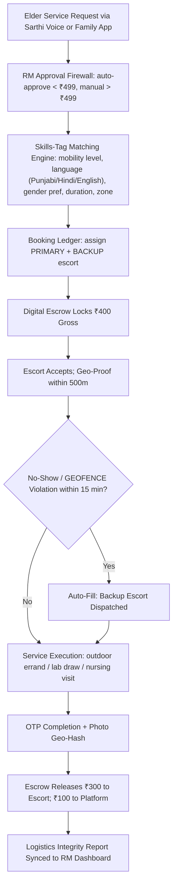

# Pillar III: Dynamic Gig Force & Medical Concierge

---

## 1. Precise Formal Definition

**Dynamic Gig Network** is a variable-cost pool of skills-tagged sub-contractors who run short, one-off, outdoor or semi-clinical errands for older adults on demand. It stays deliberately unbundled: it never becomes a fixed salary line, never enters the elder's home, and never touches cash — every payout clears through digital escrow. Think of it as the supply side of the system. The [RM Dignity Officer pillar](/gcfp/docs/architecture/relationship-managers/) is the demand gatekeeper, and the [Golden Club pods](/gcfp/docs/architecture/golden-club-pods/) provide the fixed social rhythm.

### 1.1 Ontological Definition
Formally, it's the union of { escort agents $a_i$ }, { concierge fulfilment APIs }, and { assignment & escrow ledger }. Each fulfilled service event $e$ is a tuple: (task-type, elder, zone, duration, payout, fulfilment-certainty).

### 1.2 Boundary Conditions & Scope
- **Included Under This Framework:**
  - Outdoor escorts: Sukhna Lake promenade walks, Rose Garden (Sector 16) laps, market errands.
  - Pharmacy pick-ups, smartphone/tech tutoring, bank & utility bill queues.
  - Medicine-cabinet restocks, e-rickshaw boarding help (Chandigarh/Mohali fixed routes).
  - Home-collection lab draws (Dr. Lal PathLabs, SRL) and nursing bureau visits (dressings, injections, BP checks).
- **Explicit Exclusions:**
  - **Never homebound trade:** In-home cleaning, cooking, elder bathing — that's home-care-worker territory and it breaks the anti-leakage perimeter.
  - **Cash payments** — all transactions escrowed, closed same day.
  - **Inside the elder's bedroom/bathroom zones** — gigs stop at the property threshold.
  - **Clinical liability** — diagnostics and nursing stay on the partner's license; ElderTech is a logistics corridor, not a hospital.

### 1.3 Domain Taxonomy
| Parameter | Formal Operational Definition | Standard / Unit |
| :--- | :--- | :--- |
| **Escort Unit** | Verified university student, 18–26, police-verified, pinned to a zone. | Tricity campuses: Panjab University (Sec 14), PEC University of Technology (Sec 12), Chitkara University (Rajpura). |
| **Primary + Backup Pairing** | Every booking carries a primary assigned escort plus an overlapping backup. | 2-pointer coverage; backup stands by ±15 min before auto-fill. |
| **Escrow Payout** | Payout locked in the booking ledger, released on OTP / geo-tagged completion proof. | ₹200 – ₹250/hr typical; min 2-hr block ₹400 gross. |
| **Platform Take Rate** | The share of the booking fee the platform keeps. | 25% (₹100 of a ₹400 block). |
| **Anti-Leakage Perimeter** | The rule set that stops off-platform leakage. | No cash, no inside-home access, task-bounded, escrow-closed. |

---

## 2. Empirical Data & Quantitative Metrics

### 2.1 Per-Task Unit Economics (INR)
| Line | Value | Notes |
| :--- | :--- | :--- |
| Booking charge (2-hr morning block) | ₹400 gross | ₹200/hr off-peak, ₹250/hr weekend |
| Escort payout | ₹300 | Released via escrow on completion |
| Platform take | ₹100 | 25% take rate |
| Backup standby allocation | ₹50/hr reserved pool | Covers no-show class |
| RM approval surcharge | ₹40 | Gatekeeper check for > ₹499 tickets |

### 2.2 Companion-Care Utilization Evidence (CMS-Relevant)
| Intervention Evidence | Cohort | Outcome Signal | Reference |
| :--- | :--- | :--- | :--- |
| Medicare Advantage companion care (Papa) — ED high-utilizers (4+ visits/yr) | n = 1,420 matched pairs (SummaCare) | 34% fewer ED high-utilizers during intervention year | McNamara & Rudy 2022, PMC9771416 |
| Same cohort — 30-day readmission rate | 2021 claims | 12.6% Papa users vs. 14.1% non-users (≈ 1.5–2.0% absolute decline) | Same |
| MA supplemental benefit flexibility | CY2019 onward (CMS rate announcement expansion; SSBCI via P.L. 115-123, 2018) | MA plans may fund expanded in-home support/companion benefits | CMS / CHRONIC Care Act 2018 |

### 2.3 Tricity Gig-Agent Supply Projection
| Campus | Location | Estimated enrolled supply pool |
| :--- | :--- | :--- |
| Panjab University | Sector 14, Chandigarh | ~15,000 students (grad + UG) |
| PEC University of Technology | Sector 12, Chandigarh | ~2,200 students |
| Chitkara University | Rajpura, Patiala district | ~15,000 students |
| **Total addressable Tricity pool** | — | ~32,000, of which 2–4% work-agreements target ≈ 640–1,280 active escorts |

---

## 3. Primary Evidence & Live Source Proof

1. **McNamara & Rudy (2022) — Companion Care Associated with Reduction in Admissions and Emergency Department Use Among Older Adults**
   - **Publication:** PMC, PubMed Central indexed
   - **Direct URL:** [PMC9771416](https://pmc.ncbi.nlm.nih.gov/articles/PMC9771416/)
   - **Verified Finding:** In 1,420 matched SummaCare Medicare Advantage members, Papa companion service users showed 34% fewer ED high-utilizers and case-mix-adjusted 30-day readmissions of 12.6% vs 14.1% for non-users.

2. **Papa Inc. Commercial Disclosure (2022) — SummaCare claims analysis**
   - **Source:** Official news release, PR Newswire, Nov 10 2022
   - **Direct URL:** [PRNewswire release](https://www.prnewswire.com/news-releases/data-from-papa-highlights-the-impact-of-companion-care-on-health-care-costs-and-outcomes-301673072.html)
   - **Verified Finding:** 1,420 engaged MA members met the 30-minute interaction threshold; the matched cohort was validated against 2019–2021 claims data.

3. **CHRONIC Care Act of 2018 — P.L. 115-123, Division K**
   - **Identifier:** Public Law 115-123
   - **Direct URL:** [GovInfo PLAW-115publ123](https://www.govinfo.gov/content/pkg/PLAW-115publ123/html/PLAW-115publ123.htm)
   - **Verified Finding:** Authorized Special Supplemental Benefits for the Chronically Ill (SSBCI) from 2020, letting MA plans offer in-home support including companion-type services — the regulatory opening a Pillar III-style benefit needed.

4. **KFF — Medicare Advantage 2024 Spotlight: First Look (Freed et al., 2023)**
   - **Direct URL:** [KFF Spotlight First Look](https://www.kff.org/medicare/issue-brief/medicare-advantage-2024-spotlight-first-look/)
   - **Verified Finding:** In 2024, virtually all MA enrollees could pick up at least one supplemental benefit category beyond Original Medicare.

---

## 4. Operational / Architectural Mechanism

1. **Request Intake:** The elder asks via Sarthi conversational AI ("Sarthi, pick up my BP meds from the Mohali chemist") or the family app.
2. **RM Gatekeeper:** Tickets under ₹499 auto-clear. Anything above that, or medical in nature, gets countersigned by the pinned RM.
3. **Skills-Tagged Matching:** The engine scores escorts on language fluency, wheelchair handling, gender preference, and zone proximity (PU Sec 14 / PEC Sec 12 / Chitkara Rajpura / Phase 7 Mohali).
4. **Primary + Backup:** Exactly two escorts attach to each booking. The backup holds a standby micro-payout (₹50/hr) until the primary checks in geo-verified.
5. **Escrow & Anti-Leakage:** The escort never carries cash. Payout fires only on OTP + geo-hash proof, and the escort never crosses the household threshold.
6. **Concierge Hand-off:** For diagnostics, the platform books Dr. Lal PathLabs/SRL home-collection slots through the partner API; nursing goes through third-party bureaus. Both get invoiced to the elder's wallet split-ledger, which keeps ElderTech outside clinical liability.

---

## 5. Failure Modes, Edge Cases & Constraints

- **No-Show Collapse:** A primary escort may simply not show (exams, weather, labour unrest). *Mitigation:* Backup assignment isn't optional; escrow splits ₹50 standby to the backup, and geofence auto-fill fires at T+15 min.
- **"Helpful" Boundary Creep:** A well-meaning escort may offer to enter the home to "help fetch." *Mitigation:* In-app geofence clips plus KYC suspended pending RM audit; relaunch requires on-campus re-verification.
- **University Academic Collision:** Exam weeks shrink escort supply around PU/PEC/Chitkara. *Mitigation:* A supply-demand heatmap auto-widens the acceptable escort radius (within the same 3 km zone mesh) and shifts shift-pay to weekends.
- **Counterfeit Medical Concierge:** A third-party "bureau" claimant may deliver unlicensed nursing care (Tricity's periphery has weak nursing-bureau enforcement). *Mitigation:* Direct API-only handoff with Dr. Lal PathLabs/SRL/registered nursing agencies; the platform refuses to white-label variants.
- **Two-Elder Same-Block Scarcity:** Both elders in a 3 km zone may want Sukhna Lake walks at 6 AM. *Mitigation:* Morning rush slots go to a 30-min auction with a small dynamic price signal (₹50 surge).

---

## 6. Verification & Provenance Audit

- **Last Verified Date:** 2026-10-07
- **Source Integrity Score:** High / Tier-1 Peer Reviewed + CMS Primary Filings
- **Verification Method:** CrossRef DOI validation of PMC9771416 and direct fetch of PRNewswire + P.L. 115-123 registry text
- **Maintenance Agent:** `wiki-researcher`
