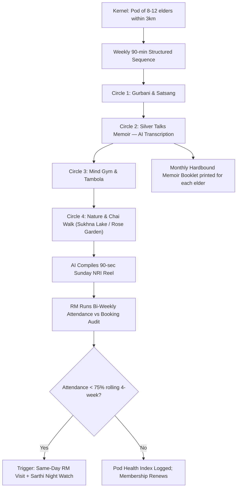

# Pillar IV: "The Golden Club" Social Pods

---

## 1. Precise Formal Definition

### 1.1 Ontological Definition
**Golden Club Pod** is a closed-membership, hyperlocal micro-community of 8–12 older adults who meet in person at a fixed weekly slot inside a 3 km catchment, under RM/Sarthi supervision, and move through a structured four-circle curriculum. What separates it from a generic senior citizen society is three things: (a) a capped cohort, built for intimacy over reach, (b) AI-transcribed memoirs that pile up over time into a real artefact, and (c) escrow-bound membership checked against actual attendance — which turns a social club into an anti-isolation intervention we can actually measure.

### 1.2 Boundary Conditions & Scope
- **Included Under This Framework:**
  - Weekly 90-minute sessions, venue inside a 3 km pedestrian catchment (e.g., Phase 7–Phase 10 Mohali, Sector 35 ↔ Sector 21 Chandigarh, Sector 5 Panchkula).
  - Four thematic circles: Gurbani & Satsang, Silver Talks Memoirs, Mind Gym & Tambola, Nature & Chai Walks.
  - Outdoor companionship anchors: Sukhna Lake Sector 1 promenade, Rose Garden Sector 16.
- **Explicit Exclusions:**
  - *Open-enrollment mass events:* Big halls of 50+ attendees dilute interaction density, so they're out.
  - *Clinical therapy groups:* Pods are leisure and community. Cognitive therapy or counselling routes to licensed cohorts.
  - *Paid gig substitutions:* Pod attendance isn't monetised per head by escorts; it's bundled into the membership SKU.

### 1.3 Domain Taxonomy
| Parameter | Formal Operational Definition | Standard / Unit |
| :--- | :--- | :--- |
| **Pod Size** | Resident elders per micro-cohort. | 8–12 (optimal social-saturation band; quorum 8). |
| **Catchment Radius** | Maximum walking/transport distance to venue. | ≤ 3 km. |
| **Session Cadence** | Weekly assembly duration. | 90 minutes, fixed slot (e.g., Sun 8:00–9:30 AM). |
| **Anti-Leakage Retention** | Weekly attendance floor monitored against bookings. | ≥ 75% active attendance over 4-week rolling window. |
| **Membership SKU** | Pricing tier bundling pod access. | ₹1,499/month bundled into GoldenCares pilot ecosystem (context: ₹499/hr elder care rate). |

---

## 2. Empirical Data & Quantitative Metrics

### 2.1 Pod-Level Unit Economics (INR / Month)
| Line | Value | Derivation |
| :--- | :--- | :--- |
| Membership yield | ₹1,499 × 10 elders = ₹14,990 | Median pod size 10 |
| Venue micro-grant | ₹3,500 | Temple basement / community centre partner |
| RM oversight allocation | ₹1,800 | 1 RM covers ~30 elders across ~3 pods |
| Chai & stationary | ₹1,200 | Fixed cost |
| **Pod contribution margin** | **₹8,490/pod/month** | ~₹849/elder |

### 2.2 Evidence on Intimate Social Networks & Health
| Study / Registry | n / Setting | Key Metric |
| :--- | :--- | :--- |
| Robert Waldinger, Harvard Study of Adult Development | 80+ year longitudinal cohort; 2023 popularization *The Good Life* | Quality of close relationships at age 50 was the strongest predictor of health & happiness at age 80 |
| Bickerdike et al., BMJ Open 2017 | 15 programme evaluations, UK NHS social prescribing | Referrals to link-worker programmes ranged 30–1,607 per scheme; all included evaluations were rated high risk of bias → ElderTech instruments paid-pod appraisal to push back on the rhetoric |
| NHS Long Term Plan 2019 | England national commitment | ≥ 900,000 people engaged via social prescribing by 2023/24 |

### 2.3 Tricity Anchor Venues
| Zone | Anchor Venue | Distance from Hub |
| :--- | :--- | :--- |
| Chandigarh | Sukhna Lake Sector 1 promenade | 8 min from Sector 24 |
| Chandigarh | Rose Garden (Sector 16) | 5 min from Sector 22 |
| Mohali | Phase 8 community market | Central to Phase 7/10 pods |
| Panchkula | Sector 5 park circuit | 4 min from Sector 20 |

---

## 3. Primary Evidence & Live Source Proof

1. **Bickerdike et al. (2017) — BMJ Open**
   - **Full Title:** *Social prescribing: less rhetoric and more reality. A systematic review of the evidence*
   - **DOI:** [`10.1136/bmjopen-2016-013384`](https://doi.org/10.1136/bmjopen-2016-013384)
   - **PubMed:** [PMID: 28389486](https://pubmed.ncbi.nlm.nih.gov/28389486/)
   - **Verified Finding:** Only 15 evaluations of link-worker programmes made the cut; referrals ranged 30–1,607, and every one carried high risk of bias — the gap a paid, auditable pod metric is meant to close.

2. **NHS England (2019) — The NHS Long Term Plan**
   - **Official URL:** [The NHS Long Term Plan](https://www.england.nhs.uk/long-read/the-nhs-long-term-plan/)
   - **Verified Finding:** Commits ≥ 900,000 people to social prescribing through a dedicated link worker by 2023/24 — national-scale backing for the small-cohort coordinator model.

3. **Harvard Study of Adult Development (Waldinger & Schulz, 2023)**
   - **Title:** *The Good Life: Lessons from the World's Longest Scientific Study of Happiness* (Simon & Schuster, 2023)
   - **Official Study Site:** [Harvard Study of Adult Development](https://www.adult-development.fas.harvard.edu/)
   - **Verified Finding:** Close relationships predict later-life physical health and brain aging better than cholesterol levels at age 50 — the clinical bet Golden Club's pod density is built on.

4. **Buurtzorg Operational Reference (KPMG / Commonwealth Fund)**
   - **Direct URL:** [Buurtzorg Organisation – Overhead 8% vs 25%](https://www.buurtzorg.com/about-us/our-organisation)
   - **Verified Finding:** Buurtzorg teams cap at 12 nurses and held overhead at 8% vs. a 25% industry average — the flat-overhead model the pod's low-cost shape borrows from.

---

## 4. Operational / Architectural Mechanism

1. **Pod Formation:** Sarthi's voice onboarding scores each elder on 4 SST dimensions (activity, language, devotional literacy, mobility), and elders get bucketed into zone pods of 8–12.
2. **Circle 1 — Gurbani & Satsang:** 20 minutes of devotional listening or singing. Elders pick their level (silent, harmonium, lead), which conveniently doubles as a non-verbal baseline for audio analysis.
3. **Circle 2 — Silver Talks Memoirs:** 25 minutes of structured life-story narration. Sarthi streams the audio to transcription; every 4 weeks an AI-typeset hardbound booklet gets printed for each elder.
4. **Circle 3 — Mind Gym & Tambola:** 25 minutes of pattern games. Tambola caller cadence is logged as an informal word-recognition signal — never a diagnosis.
5. **Circle 4 — Nature & Chai Walk:** A 20-minute guided outdoor stroll (Sukhna Lake Sector 1, Rose Garden Sector 16, or the Panchkula Sector 5 park circuit).
6. **Attendance Moat:** The RM audits attendance against bookings. A drop below 75% over four weeks triggers the same-day visit protocol — the pod itself doubles as a monitoring mesh.

---

## 5. Failure Modes, Edge Cases & Constraints

- **Inclusion-Exclusion Drift:** Aggressive matching can cluster only the most similar elders, cornering a quieter senior into silence — deepening loneliness instead of easing it. *Mitigation:* Monthly cross-pod interchange (2 elders swap pods); Sarthi tracks talk-share balance and flags elders who speak < 5% of circle minutes.
- **Weather / Smog:** October–January smog in Chandigarh-Tricity grounds venue circles. *Mitigation:* Circle 4 goes indoors — supervised walking circuits in phase community centres.
- **Memoir Booklet Grief Spike:** A recorded life-story can accidentally surface bereavement triggers. *Mitigation:* The RM sits in on Circle 2; Sarthi flags elevated vocal jitter; acute triggers route to the bereavement track.
- **Village-Town Tension:** A "golden club" risks negative caricature ("old-age camp"). *Mitigation:* Marketing uses dignity language ("Dignity Officers," "Silver Talks stage"), never deficit framing.
- **Venue Cost Volatility:** Temple basements and community centres can suddenly demand rent or get politicised. *Mitigation:* Three alternate venue slots per zone and a canonical joint-venture template.

---

## 6. Verification & Provenance Audit

- **Last Verified Date:** 2026-10-07
- **Source Integrity Score:** High / Tier-1 Systematic Review + Primary Cohort
- **Verification Method:** Direct DOI fetch (`10.1136/bmjopen-2016-013384`) + NHS England LTP page review + Harvard official study site verification
- **Maintenance Agent:** `wiki-researcher`
