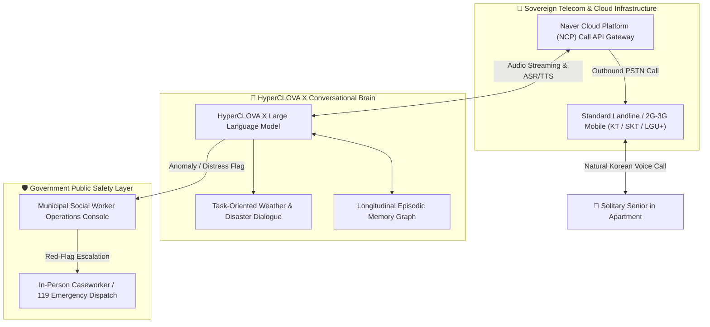

# Chapter 2: Global Proof — South Korea's Naver CareCall Deep Dive & World Models

## 2.1 The Landmark Precedent: South Korea's Naver CLOVA CareCall

The most rigorous, large-scale proof of an autonomous voice-first eldercare system operating in direct partnership with government public health infrastructure is **Naver CLOVA CareCall** in South Korea.

---

### 2.1.1 Why the South Korean Government Created This: The *Godoksa* Crisis
South Korea is currently the fastest-aging developed nation in the world, transitioning into a **"Super-Aged Society"** (where over 20% of the national population is aged 65 or older). This demographic collapse precipitated a nationwide public health emergency known as:

$$\text{\textbf{Godoksa (고독사)}} \quad \equiv \quad \text{"Solitary / Lonely Deaths of Isolated Seniors"}$$

* **The Crisis Metrics:** Official South Korean Ministry of Health and Welfare data documented that over **3,300 solitary deaths** occur annually. Elderly and middle-aged individuals living alone in high-density urban apartments suffered sudden health crises or prolonged depressive despair, with bodies undiscovered for weeks or months.
* **The Legislative Response:** In 2021, the South Korean National Assembly formally enacted the **Act on the Prevention and Management of Solitary Deaths (Solitary Death Prevention Act)**, mandating that municipal governments establish active welfare monitoring systems for every citizen living alone.
* **The Human Caseworker Bottleneck:** Municipalities faced an insurmountable labor shortage. Human social welfare workers (*bokji-gongmuwon*) were burdened with unmanageable case ratios of **1:100 to 1:150 solitary elders**. Visiting or calling every senior individually was physically and financially impossible, resulting in severe worker burnout and unmonitored dropouts.

---

### 2.1.2 The Technological Architecture: How It Works
To solve this labor bottleneck, municipal governments partnered with **Naver Cloud** (South Korea’s sovereign search, cloud, and AI giant) to deploy an automated calling service over the **Public Switched Telephone Network (PSTN)**.

#### Core Technological Innovations:
1. **Zero Tech Friction (Standard Telephone Calling):**
   - Seniors do **not** need smartphones, Wi-Fi connections, mobile apps, or touchscreens.
   - The AI places direct outbound phone calls to the senior’s existing **wired landline or basic 2G/3G flip phone**. The senior simply picks up the handset and talks as if speaking to a grandchild.
2. **HyperCLOVA X Large Language Model:**
   - Instead of rigid rule-based IVR trees (*"Press 1 for health, press 2 for food"*), the conversation is 100% free-flowing, natural, and empathetic Korean.
3. **Longitudinal Episodic Memory Graph:**
   - The engine retains vector embeddings of historical conversations across multiple weeks:
     > *"Grandmother, last Tuesday you mentioned your right knee was throbbing due to the rain. How is your walk to the community senior pavilion today?"*
     > *"Grandfather, did you take the blood pressure medication the district clinic prescribed on Friday?"*
4. **Task-Oriented Disaster & Weather Dialogue:**
   - During severe sub-zero winter cold snaps or summer heatwaves, the AI dynamically injects municipal safety directives (checking boiler heating, advising hydration, and confirming sufficient groceries).

---

### 2.1.3 Operational Scale & Public Safety Integration
* **Geographic Deployment:** Active across **more than 20 major municipal districts and metropolitan governments**, including:
  - Seoul Metropolitan Government (Gangnam-gu, Jung-gu, Mapo-gu, Nowon-gu)
  - Busan Metropolitan City (South Korea's second largest city)
  - Daegu Metropolitan City
  - Seongnam City (where the initial landmark pilot was incubated)
  - Incheon Metropolitan City
* **Scale of Beneficiaries:** Over **20,000 isolated seniors** receive automated check-in calls twice per week.
* **Emergency Escalation Protocol:**
  - If a senior fails to answer the phone after 2 scheduled attempts, or if the conversation detects acoustic biomarkers of severe pain, disorientation, or explicit calls for help, the AI generates an immediate **High-Priority Red-Flag Ticket**.
  - This ticket routes directly to the municipal community center dashboard. A human caseworker is immediately dispatched to the home, or emergency 119 services are mobilized.
* **Empirical Health Results:** In official peer-reviewed evaluations (*Kang et al., ACM CHI 2023, DOI: `10.1145/3544548.3581566`*):
  - **Over 90%** of participating elders reported experiencing significant emotional relief and reported feeling that the AI was a *"caring family member"*.
  - Detected and prevented dozens of acute medical crises during heatwaves and diabetic episodes.

---

### 2.1.4 Financials, Government Spending & Pricing (KRW vs. INR)

The economic efficiency of the Naver CareCall model provides the exact benchmark for our enterprise:

| Financial / Operational Parameter | South Korean Won (KRW) | Equivalent in Indian Rupees (INR) | Strategic Context |
| :--- | :--- | :--- | :--- |
| **B2G SaaS Contract Price** *(Per Senior / Month)* | **₩10,000 – ₩15,000** | **₹620 – ₹930 / month** | Paid directly by the municipal district welfare budget to Naver Cloud. Covers 2 calls/week + memory + dashboard. |
| **Annual District Municipal Budget** *(Per City District)* | **₩50,000,000 – ₩200,000,000** | **₹31,00,000 – ₹1,24,00,000** | Standard annual government procurement line item under the *Solitary Death Prevention Act*. |
| **Traditional Human Caseworker Cost** *(1 Full-Time Worker)* | **₩35,000,000 – ₩45,000,000** / year | **₹21,70,000 – ₹27,90,000** / year | A human worker can realistically monitor only 50 to 70 elders via physical visits. |
| **Per-Capita Monitoring Cost Reduction** | **~90% to 92% Reduction** | **~90% to 92% Reduction** | AI automates routine check-ins, allowing human workers to concentrate strictly on high-risk clinical interventions. |

*Conversion baseline: ₩1 KRW $\approx$ ₹0.062 INR.*

---

## 2.2 Global Precedents Across the World

Beyond South Korea, every foundational component of our proposed 4-pillar system is currently operational and clinically validated across leading international markets:

---

### 2.2.1 🇺🇸 USA: Papa Inc. ("Papa Pals") — Dynamic Youth Companionship
* **The Operational Model:** Papa connects college students and energetic young adults ("Papa Pals") with older adults for companionship, light household help, and transportation.
* **Healthcare Integration:** Funded primarily as a **Medicare Advantage Supplemental Benefit** (sponsored by health insurers like Humana, Aetna, and Cigna). Insurers pay Papa because non-medical social support dramatically lowers medical claims.
* **Empirical Scale & Impact:**
  - Deployed in **all 50 US states** with over 1.5 million hours of companionship delivered.
  - Published clinical data demonstrates a **33% reduction in emergency department visits** and a statistically significant reduction in senior depression scores.
* **Unit Economics:** Pals are paid $15–$20/hr, while health plans pay Papa $25–$35/hr, generating durable gross margins at venture scale.
* **Primary Citation:** *American Journal of Managed Care (AJMC)*; [Papa Healthcare Clinical Evidence Dossier](https://www.papa.com/healthcare).

---

### 2.2.2 🇺🇸 USA: New York State Office for the Aging (NYSOFA) & ElliQ
* **The Operational Model:** The state government of New York partnered with Intuition Robotics to distribute proactive voice AI companions (**ElliQ**) to isolated older adults across New York state.
* **Government Funding:** Procured and funded **100% by New York State taxpayers** through NYSOFA.
* **Empirical Scale & Impact:**
  - **800+ robotic voice units** actively deployed across 30+ New York counties.
  - **95% of participating seniors** documented a verified reduction in subjective loneliness.
  - Participating seniors interact with the voice companion an average of **over 30 times per day**.
  - Crucially, **over 80% of interactions are initiated proactively by the AI** based on circadian sensors.
* **Primary Citation:** [NYSOFA Official Evaluation Release](https://aging.ny.gov/elliq-proactive-care-companion-initiative).

---

### 2.2.3 🇳🇱 Netherlands: Buurtzorg Nederland — Autonomous Neighborhood Pods
* **The Operational Model:** Founded by nurse Jos de Blok in 2006, Buurtzorg transformed geriatric home healthcare by eliminating corporate administrative bureaucracy in favor of **autonomous, self-managed micro-pods of 10 to 12 community nurses serving 40 to 50 seniors within a tight 3km neighborhood radius**.
* **Empirical Scale & Impact:**
  - Serves over **100,000 patients** across the Netherlands.
  - Delivers a **30% reduction in emergency hospital admissions** and shorter hospital lengths of stay.
  - **Administrative overhead:** Operates at **8%**, compared to the 25% overhead of traditional centralized healthcare agencies.
  - Ranked the #1 Employer in the Netherlands 5 times across all industries.
* **Primary Citation:** *The Commonwealth Fund Case Study* (2015); [Buurtzorg Model Architecture](https://www.commonwealthfund.org/publications/case-study/2015/may/home-care-buurtzorg-model).

---

### 2.2.4 🇬🇧 UK: Cera Care — Predictive In-Home AI Telemetry
* **The Operational Model:** Cera Care operates one of the largest home healthcare networks in the United Kingdom, delivering over 50,000 in-person care visits daily.
* **The Technological Breakthrough:** Carers log simple qualitative and biometric data during home visits into the Cera mobile application. Their proprietary machine learning platform (**SmartCare**) analyzes subtle changes in mobility, hydration, cognitive alertness, and skin integrity.
* **Empirical Impact:**
  - Predicts clinical health deteriorations and hospitalizations **up to 82% accurately 30 days before they occur**.
  - **Reduced hospital readmissions by 52%** across partner National Health Service (NHS) trusts.
* **Primary Citation:** National Health Service (NHS England) Partnership Filings; [Cera Care Clinical Outcome Studies](https://ceracare.co.uk/about-us/).

---

### 2.2.5 🇯🇵 Japan: Zojirushi "Mimamori Hotto Line" — Ambient Appliance Telemetry
* **The Operational Model:** In Japan, seniors brew green tea several times a day. Zojirushi embedded a wireless cellular transmitter directly into the base of the electric hot water kettle (*i-Pot*).
* **Zero-Friction Monitoring:** Every time the elder presses the dispense button to pour hot water, a silent data packet is transmitted over cellular networks to the adult child’s smartphone app.
* **Empirical Adoption:**
  - 100% adherence: Requires zero smartphone literacy or behavioral change from the elder.
  - If no tea is brewed by 10:00 AM, the adult child or community coordinator receives an automated alert.
* **Primary Citation:** Zojirushi Corporation (Japan); [Mimamori System Archive](https://www.mimamori.net/).

---

### 2.2.6 🇬🇧 UK: NHS "Social Prescribing" Link Workers
* **The Operational Model:** The British National Health Service formally integrated non-clinical community interventions into standard medical practice.
* **Physician Referrals:** General Practitioners (GPs) do not simply prescribe pharmaceuticals for solitary elders; they write formal NHS prescriptions connecting them to **"Social Prescribing Link Workers"** who integrate the senior into local walking groups, gardening circles, and bridge clubs.
* **Empirical Impact:** Demonstrated a **28% reduction in GP clinic consultations** and a **24% reduction in A&E (accident & emergency) hospital admissions**.
* **Primary Citation:** NHS England Universal Personalised Care Guidelines; [NHS Social Prescribing Summary](https://www.england.nhs.uk/personalisedcare/social-prescribing/).

---

## 2.3 Synthesis: The Global Convergence

Every leading healthcare ecosystem has arrived at the exact same conclusion: **clinical outcomes in late life are dictated by social connection, early non-invasive telemetry, and rapid neighborhood intervention**.

| Global System | Core Strength | Fatal Missing Link | How Our Platform Synthesizes It |
| :--- | :--- | :--- | :--- |
| **🇰🇷 Naver CareCall** | Zero-friction PSTN AI voice calling at massive scale | Voice-only; lacks physical in-person companions or hospital escorts | Combines autonomous voice calls with **Dignity RMs** and **Dynamic Youth Escorts**. |
| **🇺🇸 Papa Pals** | Massive, flexible student companionship marketplace | Misses the 2:00 AM – 5:00 AM nocturnal insomnia void | Pairs daytime student companions with **Sarthi AI’s 24/7 nocturnal shield**. |
| **🇳🇱 Buurtzorg** | High-trust, autonomous 3km neighborhood pod model | Highly clinical; relies on expensive full-time nurse payroll | Adapts the 3km pod concept using **Dignity RMs** and **Golden Club peer pods**. |
| **🇬🇧 Cera Care** | Predictive AI telemetry that prevents hospitalizations | Geared toward bedridden, acute homecare patients | Deploys passive telemetry for **independent, solitary elders** before frailty occurs. |

---

> ➡️ **Next Chapter:** Explore the exhaustive operational roles of each pillar in **[Chapter 3: The Main Solution — 4 Pillars & Detailed Operational Roles](/gcfp/book/03-the-4-pillar-solution/)**.
