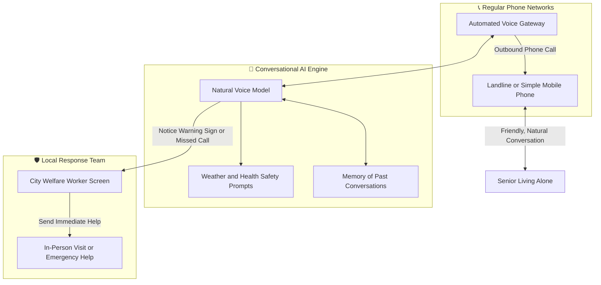

# Chapter 2: What Works Globally: South Korea's CareCall & World Models

## 2.1 The Big Example: South Korea's CareCall System

If you want proof that automated voice check-ins actually work, look at **Naver CareCall** in South Korea. It runs at real scale, with the government backing it.

---

### 2.1.1 Why the South Korean Government Built This
South Korea is aging faster than almost any other country. More than 20% of its people are over 65. That shift created a serious national problem:

**The Solitary Death Crisis:** Every year, more than 3,300 seniors in South Korea die quietly at home, and nobody knows for days or sometimes weeks.

- **The Law Passed in 2021:** The government passed a nationwide law requiring city councils to check on every senior living alone.
- **The Social Worker Shortage:** Social workers were drowning. Each one had 100 to 150 seniors on their list. There was no way to visit or call everyone every week. Workers burned out, and many seniors fell through the cracks.

---

### 2.1.2 How the Voice System Works
To close that gap, city governments teamed up with **Naver** (South Korea's biggest tech and search company) to build an automated phone system. It calls seniors directly, on their regular phone lines.

#### Why This Works So Well:
1. **No New Technology to Learn:**
   - Seniors do **not** need smartphones, apps, or Wi-Fi.
   - The system calls their normal home landline or basic mobile. They just pick up and talk, like chatting with a caring grandchild.
2. **Natural Conversations:**
   - No robotic menus ("Press 1 for health, Press 2 for food"). The call feels like a real, friendly conversation.
3. **Remembering Past Details:**
   - The system remembers what the senior said on earlier calls:
     > *"Grandmother, last week you mentioned your right knee hurt because of the rain. How is your knee feeling today?"*
     > *"Grandfather, did you pick up your blood pressure medicine from the clinic on Friday?"*
4. **Seasonal Safety Checks:**
   - During harsh winter cold or summer heatwaves, it automatically checks if the heating is on, reminds them to drink water, and asks whether they have enough food at home.

---

### 2.1.3 Scale and Results
- **Where It Operates:** Running in more than 20 major cities and districts, including Seoul, Busan, Daegu, and Incheon.
- **How Many Seniors It Helps:** Over **20,000 seniors living alone** get automated check-in calls twice a week.
- **Emergency Action:** If a senior misses two scheduled calls in a row, or the conversation hints at pain or distress, the system immediately flags the local welfare office. A human worker visits the home right away.
- **Real Feedback from Seniors:** In university studies, **over 90% of participating seniors** said the calls brought them comforting emotional relief, and that they felt like a family member was checking in.

---

### 2.1.4 The Numbers: South Korean Costs vs. Indian Rupees

CareCall's economics explain why automated check-ins make financial sense:

| Item | In South Korean Won (KRW) | Equivalent in Indian Rupees (INR) | What It Means for Us |
| :--- | :--- | :--- | :--- |
| **Monthly Cost per Senior** | **₩10,000 to ₩15,000** | **₹620 to ₹930 per month** | Paid by the local city council. Covers 2 calls per week, conversation memory, and live dashboard alerts. |
| **Annual District Budget** | **₩50,000,000 to ₩200,000,000** | **₹31 Lakhs to ₹1.24 Crores** | A standard city budget line to protect thousands of solitary seniors. |
| **Cost of One Full-Time Social Worker** | **₩35,000,000 to ₩45,000,000** / yr | **₹21.7 Lakhs to ₹27.9 Lakhs** / yr | A human worker can realistically visit only 50 to 70 seniors on a regular basis. |
| **Cost Reduction per Person** | **Over 90% Savings** | **Over 90% Savings** | The automated voice system takes the routine check-ins, freeing human workers for real emergencies. |

---

## 2.2 Proven Models Around the World

Care models across the United States, Europe, and Asia confirm that every piece of our plan already works somewhere:

---

### 2.2.1 🇺🇸 United States: Papa ("Papa Pals") — Student Companions
- **How It Works:** Papa pairs college students and young adults with seniors for companionship, light household help, and rides to doctor appointments.
- **Who Pays:** Major health insurance companies (Humana, Aetna, Cigna) fund it through their Medicare Advantage plans. Insurers pay because non-medical social support keeps seniors out of the hospital.
- **Proven Impact:** Active in all 50 US states. Clinical studies show a **33% drop in emergency hospital visits**, plus big improvements in mood and outlook.
- **The Business Model:** Students earn $15 to $20 per hour, while health insurance plans pay Papa $25 to $35 per hour.

---

### 2.2.2 🇺🇸 United States: New York State & ElliQ — Voice Companions
- **How It Works:** The New York State government partnered with Intuition Robotics to put proactive voice companions into the homes of older adults living alone.
- **Proven Impact:** Over 800 units deployed. **95% of participating seniors reported feeling noticeably less lonely**.
- Seniors interact with the device an average of **over 30 times a day**, and the device starts most of those conversations on its own.

---

### 2.2.3 🇳🇱 Netherlands: Buurtzorg — Neighborhood Teams
- **How It Works:** Founded by nurse Jos de Blok, Buurtzorg scrapped bloated corporate headquarters in favor of small, self-run teams of 10 to 12 nurses covering 40 to 50 seniors within a tight **3-kilometer neighborhood**.
- **Proven Impact:** Serves over 100,000 seniors in the Netherlands with a **30% reduction in emergency hospital visits**. Management overhead sits at just 8%, versus 25% at traditional healthcare agencies.

---

### 2.2.4 🇬🇧 United Kingdom: Cera Care — Early Health Warning System
- **How It Works:** Cera Care delivers over 50,000 in-person care visits across the UK every day. Helpers log simple daily observations in their mobile app: walking speed, water intake, mood, and sleep.
- **Proven Impact:** Their system predicts health declines and potential hospital visits **up to 82% accurately, 30 days before they happen**, cutting hospital readmissions by 52%.

---

### 2.2.5 🇯🇵 Japan: The Smart Electric Kettle
- **How It Works:** Japanese kitchen brand Zojirushi built a simple wireless chip into electric hot water kettles.
- **Why It Works:** Japanese seniors brew green tea several times a day. Each time they pour hot water, a quiet signal goes to their adult child's phone.
- If no tea has been brewed by 10:00 AM, the child or local care coordinator gets a gentle notification. The senior needs zero tech skills.

---

### 2.2.6 🇬🇧 United Kingdom: Social Prescriptions by Doctors
- **How It Works:** In the UK, family doctors don't just hand out medicine when lonely seniors come in. They write official referrals to community coordinators, who connect seniors with local walking clubs, gardening groups, and card games.
- **Proven Impact:** This led to a **28% reduction in clinic visits** and a **24% drop in emergency room admissions**.

---

## 2.3 How We Bring These Lessons Together

Almost every elder care success story in the world lands on the same truth: **keeping seniors healthy and happy comes down to regular social connection, early warning tracking, and fast neighborhood response**.

| Proven Global Model | What It Does Best | What It Misses | How We Combine It |
| :--- | :--- | :--- | :--- |
| **🇰🇷 Naver CareCall** | Friendly, zero-effort phone check-ins at huge scale | Voice only; can't visit in person or go along to doctors | We pair voice check-ins with **in-person Relationship Managers** and **student companions**. |
| **🇺🇸 Papa Pals** | High-energy student visits for walks and activities | Goes quiet between 2:00 AM and 5:00 AM, when seniors wake up alone | We combine daytime student visits with **24/7 night voice support**. |
| **🇳🇱 Buurtzorg** | High-trust, tight 3-kilometer neighborhood teams | Expensive, because it depends entirely on full-time nursing salaries | We adapt the 3-kilometer pod model using **Relationship Managers** and **local senior social clubs**. |
| **🇬🇧 Cera Care** | Early warnings that prevent emergency hospital visits | Aimed mostly at seniors who are already sick or bedridden | We track simple daily patterns for **independent seniors**, before serious health problems start. |

---

> ➡️ **Next Chapter:** See how our 4 core pillars work day-to-day in **[Chapter 3: The Complete Solution — The 4 Core Pillars](/gcfp/book/03-the-4-pillar-solution/)**.
