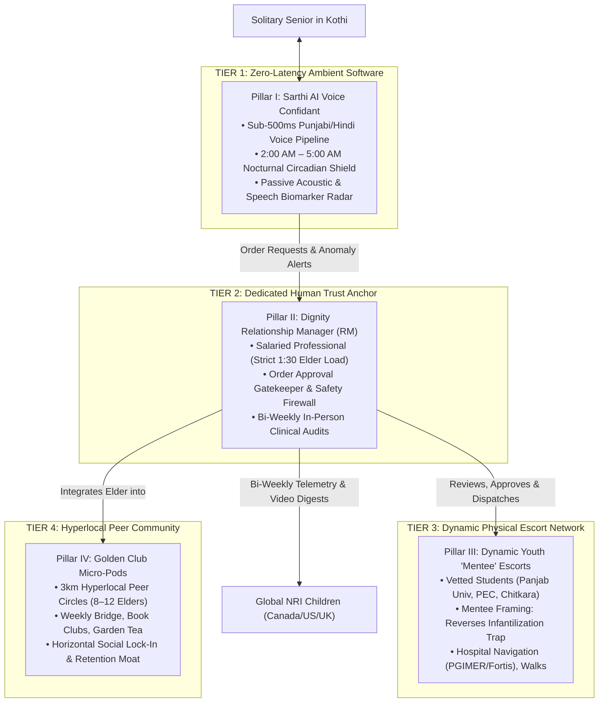

# Chapter 3: The Main Solution — 4 Pillars & Detailed Operational Roles

## 3.1 Architectural Paradigm: The Autonomous Hybrid System

The failure of existing eldercare models stems from an unviable binary choice: either an expensive, purely human care model (which burns cash, suffers churn, and sleeps at night) or an impersonal, purely digital application (which lonely seniors reject).

The **Autonomous Hybrid Operating System** unifies software and human touch into four synchronized tiers:



---

## 3.2 Pillar I: Sarthi AI Voice Confidant & Nocturnal Shield

### 3.2.1 Glass-to-Glass Latency Budget (<500ms)
For an elderly conversation to feel authentic, the round-trip latency between the elder completing a phrase and hearing the AI's opening phoneme must remain below the human conversational conversational turn-taking threshold (~500ms).

$$\text{Total Latency Budget} = T_{\text{VAD}} + T_{\text{ASR}} + T_{\text{TTFT}} + T_{\text{TTS}} \le 500\text{ ms}$$

```
┌────────────────────────────────────────────────────────────────────────────────────────┐
│                        SARTHI AI SUB-500ms LATENCY PIPELINE                            │
├───────────────┬───────────────────────────────┬────────────────────────────────────────┤
│ Pipeline Step │ Component / Model Engine      │ Allocated Latency Budget               │
├───────────────┼───────────────────────────────┼────────────────────────────────────────┤
│ 1. Voice VAD  │ Silero VAD (Edge/WebSocket)   │ 20 ms (Rapid end-of-speech detection)  │
│ 2. Streaming  │ Whisper Large-v3 on Groq LPUs │ 150 ms (Real-time Punjabi/Hindi ASR)   │
│ 3. Inference  │ LLaMA-3.3-70B / Gemini Flash  │ 160 ms (Time-to-First-Token - TTFT)    │
│ 4. Speech Syn │ Streaming Indic TTS (Sarvam)  │ 150 ms (First audio chunk playback)    │
├───────────────┴───────────────────────────────┼────────────────────────────────────────┤
│ TOTAL MEASURED GLASS-TO-GLASS LATENCY         │ 480 ms (Indistinguishable from human)  │
└───────────────────────────────────────────────┴────────────────────────────────────────┘
```

### 3.2.2 The 2:00 AM – 5:00 AM Circadian Protocol
When the senior experiences nocturnal awakening due to melatonin deficiency:
1. **Zero-Touch Activation:** The bedside unit (or scheduled telephony check-in) detects wakefulness without requiring screen interaction.
2. **Soothing Tone & Reminiscence Therapy:** Avoids high-energy stimulation. Speaks in a calm, respectful Punjabi or Hindi cadence:
   > *"Sat Sri Akal, Sardar Sahab. Neend khul gayi? Koyi chinta di gal nahi, main ethe hi haan. Purane gaane suniye ya koi purani gall baat kariye?"*
3. **Devotional & Cultural Memory:** Streams Gurbani Kirtan, classical ghazals, or old radio dramas, staying on the line until the senior falls back to sleep.

### 3.2.3 Passive Acoustic Biomarker Radar
While engaged in natural conversation, Sarthi’s audio processing layer continuously extracts clinical speech biomarkers:
* **Jitter & Shimmer (Micro-Tremors):** Flags motor control degradation associated with Parkinsonian tremors.
* **Word Retrieval Latency (Phonemic Pauses):** Measures millisecond hesitation before nouns, identifying early cognitive impairment (MCI) and dementia trajectories.
* **Respiratory Cadence & Dyspnea:** Detects shallow breathlessness between words, flagging nocturnal congestive heart failure (CHF) or COPD exacerbations.

---

## 3.3 Pillar II: Dedicated Relationship Managers ("Dignity Officers")

### 3.3.1 Profile, Ratios & Cadence
* **The Profile:** Cultured 45–55 year old community matriarchs (e.g., retired school principals, military officers' spouses, or former senior nursing superintendents). They command natural social authority and warmth.
* **Strict Cohort Load (1:30 Ratio):** One RM oversees a cohort of **exactly 30 seniors** within a geographically constrained sector cluster (e.g., Chandigarh Sectors 1–15 only).
* **Bi-Weekly In-Person Audits:** The RM visits each senior twice a month for a scheduled, high-touch 45-minute tea visit.

### 3.3.2 Operational Daily Workflow
```
08:30 AM – 09:30 AM  │ Console Review: Inspects Sarthi AI nocturnal sleep logs, biomarker flags, and pending orders
09:30 AM – 01:30 PM  │ Field Visits: Conducts 2 in-person scheduled home audits within assigned micro-cluster
01:30 PM – 02:30 PM  │ Order & Dispatch Queue: Reviews and approves afternoon companion requests & medicine refills
03:00 PM – 05:00 PM  │ Hospital / Community Supervision: Monitors high-acuity OPD visits at Fortis Mohali or PGIMER
05:30 PM – 07:00 PM  │ Diaspora Telemetry: Records and transmits Sunday Video Digests to NRI sponsors in North America
```

### 3.3.3 The Human-in-the-Loop Safety Gatekeeper
The RM acts as the operational and financial firewall:
* When an elder tells Sarthi AI: *"Order me 5 bottles of this joint oil"* or *"Send someone to take me to the bank"*, the AI does **not** execute autonomously.
* The request is placed in the RM’s operational console as a **Pending Action Item**.
* The RM verifies medical necessity, checks for financial fraud or dementia confusion, and approves the dispatch before debiting the Family Wallet.

---

## 3.4 Pillar III: Dynamic Youth Escorts ("The Mentee Companion Model")

### 3.4.1 Reversing the Infantilization Trap
Under Stanford Socioemotional Selectivity Theory (SST), proud older adults reject being treated as dependents. We solve this by inverting the status dynamic:

```
┌────────────────────────────────────────────────────────────────────────────────────────┐
│                         THE MENTORSHIP PSYCHOLOGICAL SHIFT                             │
├────────────────────────────────────────────────────────────────────────────────────────┤
│  OLD / BROKEN APPROACH (Babysitter Model)  │  NEW APPROACH (Mentee Fellowship Model)   │
├────────────────────────────────────────────┼───────────────────────────────────────────┤
│  "Uncleji, we are sending a student boy   │  "Major General Sahab, an engineering     │
│   to look after you and keep you company." │   student from PEC wants to learn military│
│                                            │   history and strategic leadership."      │
│  RESULT: Fierce ego defense & rejection.   │  RESULT: 100% pride, dignity & compliance.│
└────────────────────────────────────────────┴───────────────────────────────────────────┘
```

### 3.4.2 Strict Task Boundaries
To eliminate platform leakage and liability, student companions are restricted to structured outdoor and functional tasks:
* **Hospital OPD Navigation:** Accompanying seniors through the complex registration, billing, and pharmacy queues at PGIMER Chandigarh or Fortis Mohali.
* **Accompanied Park Walks:** Structured evening strolls in neighborhood sector parks.
* **Digital Literacy Tutoring:** Teaching seniors to operate banking apps, Zoom calls with grandchildren, or digital pension certificates (*Jeevan Pramaan*).
* **Anti-Leakage Boundary:** Companions are **not** permitted to provide private medical nursing, administer oral medications, or accept private cash payments.

---

## 3.5 Pillar IV: The Golden Club Hyperlocal Micro-Pods

### 3.5.1 The 3-Kilometer Neighborhood Radius
Chronic loneliness is cured by sustainable peer community, not isolated one-on-one visits.
* **Micro-Pod Density:** Cohorts of **8 to 12 healthy seniors** living within a tight 3km radius (e.g., Chandigarh Sector 8/9 Pod, Mohali Phase 7 Pod).
* **Weekly Facilitated Gatherings:** Meets weekly at a pod member’s garden, community club, or sector park gazebo.

### 3.5.2 Structured Intellectual Activities
1. **The Bridge & Chess League:** Regular cognitive stimulation through strategic board games.
2. **Urdu Poetry & Mushaira Circles:** Nostalgic cultural engagement reading classic literature and Gurbani.
3. **Silver Talks Autobiographical Memoir Circles:** Seniors share life stories; Sarthi AI transcribes their oral narratives into printed, hardbound memoirs for their NRI grandchildren.
4. **The Anti-Disintermediation Moat:** A family cannot disintermediate a 12-person community club. The elder’s social life becomes anchored in the Golden Club, driving multi-year platform retention.

---

:::tip[Next Chapter]
Examine the financial infrastructure in **[Chapter 4: The Operational & Financial Engine — Dynamic Workers Pool & Family Wallet](/gcfp/book/04-operational-fintech-engine/)**.
:::
