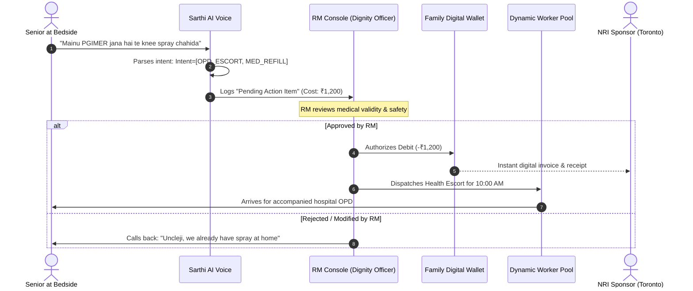

# Chapter 4: The Operational & Financial Engine

## 4.1 The Dynamic Workers Pool: Zero Idle Payroll

A primary failure mode of venture-backed eldercare companies (such as Goodfellows India) is placing companions on fixed, full-time payrolls (₹25,000–₹35,000/month). In geographic regions with fluctuating demand, fixed employee overhead creates an immediate, unsustainable cash burn.

### 4.1.1 Skills-Tagged Dynamic Matching
Our architecture treats companions and gig attendants as a curated, on-demand workforce mobilized strictly upon demand:

```
┌────────────────────────────────────────────────────────────────────────────────────────┐
│                        DYNAMIC WORKFORCE TAXONOMY & MATCHING                           │
├─────────────────────┬─────────────────────────────────┬────────────────────────────────┤
│ Worker Tier         │ Sourced Pool                    │ Tagged Operational Tasks       │
├─────────────────────┼─────────────────────────────────┼────────────────────────────────┤
│ 1. Youth Mentees    │ Panjab Univ (PU), PEC, Chitkara │ Walks, Tech tutorials, Chess   │
│ 2. Health Navigators│ Nursing/Physiotherapy Students  │ PGIMER / Fortis OPD queues     │
│ 3. Certified GDAs   │ Partnered Geriatric Bureaus     │ Post-op wheelchair transfers   │
│ 4. Licensed Physios │ Freelance Physiotherapists      │ In-home fall prevention rehab  │
└─────────────────────┴─────────────────────────────────┴────────────────────────────────┘
```

* **Just-In-Time Dispatch:** Companions are mobilized strictly when a booking or prescription is verified.
* **Geographic Micro-Clusters:** Workers are restricted to a maximum 4-kilometer transit radius from their university campus or residence, eliminating inter-sector commute delays and transportation drag.

---

## 4.2 The RM Order Approval Firewall

Allowing older adults—especially those with early cognitive impairment or sensory deficits—to directly initiate financial transactions or service dispatches via an autonomous AI voice call creates severe financial exploitation risks.

### 4.2.1 The Human-in-the-Loop Filter Sequence


### 4.2.2 Clinical & Legal Safeguards
* **Anti-Scam Firewall:** Prevents predatory telemarketers or third-party phishing from manipulating the AI voice engine.
* **Dementia Protection:** Prevents seniors suffering from temporary confusion or memory lapses from placing repetitive or dangerous orders (e.g., ordering 10 duplicate glucose monitors).

---

## 4.3 The Dual-Bucket Family Digital Wallet

To eliminate platform leakage and resolve the cross-generational conflict between frugal parents and anxious NRI children, we deploy a **Dual-Bucket Fintech Architecture**.

```
┌────────────────────────────────────────────────────────────────────────────────────────┐
│                        THE DUAL-BUCKET DIGITAL WALLET                                  │
├────────────────────────────────────────────┬───────────────────────────────────────────┤
│ BUCKET A: Health & Core Care Wallet        │ BUCKET B: Dignity Freedom Float           │
├────────────────────────────────────────────┼───────────────────────────────────────────┤
│ • Funded directly by NRI child (USD/CAD)   │ • Fixed monthly allowance (e.g. ₹5,000)   │
│ • Fully itemized with digital receipts     │ • Zero itemized surveillance by child     │
│ • RM audits, lab tests, prescriptions      │ • Tea companions, outings, hobbies        │
│ • Child possesses transparency & oversight │ • Preserves senior dignity & autonomy     │
└────────────────────────────────────────────┴───────────────────────────────────────────┘
```

### 4.3.1 Resolving the "Dignity Clash"
* **The Failure in Traditional Models:** When adult children see every single rupee spent, they inevitably question purchases: *"Papa, why did you spend ₹800 on a companion for the plant nursery?"* This humiliates the proud elder and causes them to abandon the platform.
* **The Solution:** The **Dignity Freedom Float** operates as a discretionary pool. The elder can verbally book companions for gardening, social visits, or sweets using their Freedom Float with **zero veto power or itemized audit from the overseas child**.

---

## 4.4 The Modular Add-On Marketplace

Rather than offering rigid one-size-fits-all packages, the platform monetizes through high-margin, personalized recurring and on-demand add-ons:

### 4.4.1 Monthly Chronic Care Packages
* **Cardio-Metabolic Management (₹3,500/month):** Monthly home phlebotomy (HbA1c, lipid profile), remote cardiologist review, and weekly pill-box organization by the RM.
* **Geriatric Physiotherapy (₹6,000/month):** 2x weekly in-home physical therapy targeting balance, gait retraining, and fall risk reduction.
* **Nutritional Longevity Basket (₹4,500/month):** Curated low-sodium, high-protein organic groceries delivered weekly.

### 4.4.2 On-Demand Event Add-Ons
* **Hospital OPD Navigation (₹1,200 / session):** 4-hour dedicated health escort managing doctor appointments, billing queues, and medicine pickup at PGIMER Chandigarh or Fortis Mohali.
* **Accompanied Social Outing (₹800 / session):** 3-hour accompanied trip to Sukhna Lake, Sector 17 Plaza, or family gatherings.
* **Emergency Rapid Response (₹2,500 / event):** Immediate on-ground mobilization of the RM and an emergency medical escort to accompany the senior in an ambulance to the emergency room.

---

:::tip[Next Chapter]
Examine the technical reality and telecom architecture in **[Chapter 5: Current Ground Reality — Technical Hurdles & Telephony Stack](/gcfp/book/05-current-hurdles-and-telephony-stack/)**.
:::
