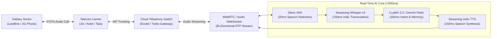

# Chapter 5: Current Ground Reality — Technical Hurdles & Telephony Stack

## 5.1 The Honest Technical Audit: What We Lack Today

To build an institutional-grade enterprise, we must confront the **hard operational and technological reality** of our current early stage:

```
┌────────────────────────────────────────────────────────────────────────────────────────┐
│                        CURRENT STATE AUDIT: GAPS VS. REQUIREMENTS                      │
├─────────────────────┬─────────────────────────────────┬────────────────────────────────┤
│ Technology Layer    │ Current Ground Status           │ Production Requirement        │
├─────────────────────┼─────────────────────────────────┼────────────────────────────────┤
│ 1. Voice AI Brain   │    No fine-tuned in-house model │ Proprietary Punjabi/Hindi LLM  │
│ 2. Telephony Lines  │    No SIP trunks / PRI lines    │ Carrier SIP Trunk (Exotel/Jio) │
│ 3. Telecom Entity   │    No TRAI DLT registration     │ Enterprise Principal Entity    │
│ 4. Hardware Unit    │    Off-the-shelf smartphones    │ Bedside Dedicated Voice Box    │
└─────────────────────┴─────────────────────────────────┴────────────────────────────────┘
```

---

### Gap 1: Lack of In-House Fine-Tuned Voice Models
* **Current Status:** Our current prototypes rely on chaining third-party cloud APIs (e.g., Groq API for Whisper Large-v3, cloud LLaMA-3.3, and external Indic TTS engines like Sarvam AI or ElevenLabs).
* **The Vulnerability:**
  - Standard foundational models frequently stumble on **elderly vernacular speech patterns**: seniors with missing teeth, slurred diction, or heavy regional dialects (such as rural Majhi, Malwai, and Doabi Punjabi mixed with colloquial Hindi and English).
  - API rate limits, cold starts, and vendor pricing make commercial scaling expensive.
* **The Requirement:** We must train and fine-tune a **domain-specific Geriatric Indic Speech-to-Speech Model** trained on conversational recordings of elderly Punjabi/Hindi speakers.

---

### Gap 2: Lack of Telecom Phone Lines & SIP Infrastructure
* **Current Status:** We do **not** currently possess an enterprise telecom line or SIP trunk capable of placing direct automated phone calls to standard landlines or 2G flip phones.
* **The Vulnerability:**
  - Unlike South Korea’s Naver CareCall (which operates on nationwide telco carrier switches), we cannot currently dial an 85-year-old’s home landline in Chandigarh Sector 9 automatically.
* **The Requirement:** Provisioning dedicated **Enterprise SIP Trunks** (via Tata Teleservices, Reliance Jio, or Bharti Airtel) interfaced through a cloud telephony gateway (such as Exotel or Twilio).

---

## 5.2 The Complete Telephony Engineering Architecture

To bridge the gap between cloud AI and an elderly citizen's regular telephone, we must deploy a **full-duplex telephony streaming architecture**:



### Component Technical Specifications:
1. **Carrier SIP Trunk:** A dedicated SIP channel capable of handling 50 concurrent outbound voice calls without jitter or packet loss.
2. **Audio WebSocket Bridge:** Converts 8kHz telephony audio (G.711 / μ-law) into 16kHz linear PCM streams for real-time transcription.
3. **Streaming Indic ASR:** Real-time speech-to-text pipeline transcribing code-switched Hinglish/Punglish with dialect tolerance.
4. **Episodic Vector Cache:** Redis-backed vector store retrieving senior biographical memories in under 15ms.

---

## 5.3 Indian Regulatory & Compliance Hurdles

Deploying an autonomous telephonic eldercare service in India requires navigating strict statutory frameworks:

---

### 1. TRAI DLT & Anti-Spam Compliance
* **The Hurdle:** Under the **Telecom Regulatory Authority of India (TRAI)** Telecom Commercial Communications Customer Preference Regulations (TCCCPR), automated outbound calls are strictly regulated to prevent spam.
* **The Compliance Path:**
  - Register as a **Principal Entity (PE)** on the telecom Distributed Ledger Technology (DLT) platform (Vilpower/Jio/Airtel).
  - Register explicit **Transactional / Service Explicit Call Templates** (e.g., *"Daily Elder Health Verification"*).
  - Establish an official **Customer Consent Exemption** ensuring that seniors registered on the national Do-Not-Disturb (DND) registry still receive their critical health check-in calls.

---

### 2. Department of Telecommunications (DoT) PSTN Interconnect Rules
* **The Hurdle:** Indian telecom law historically restricted the interconnectivity between Voice-over-IP (VoIP) cloud networks and the Public Switched Telephone Network (PSTN) to prevent bypass of national long-distance carrier charges.
* **The Compliance Path:** Ensure all cloud telephony gateways are routed through licensed **Other Service Provider (OSP)** domestic cloud nodes hosted within Indian data centers with strict toll-bypass compliance.

---

### 3. Digital Personal Data Protection (DPDP Act 2023) & Health Privacy
* **The Hurdle:** The Digital Personal Data Protection Act of 2023 classifies voice recordings and health logs as sensitive personal data.
* **The Compliance Path:**
  - Implement **Multi-Party Consent Architecture:** Explicitly signed by both the senior and their overseas NRI child during initial onboarding.
  - **End-to-End Encryption:** Audio recordings stored in SOC-2 / ISO-27001 compliant cloud servers within Indian geographic boundaries.
  - **De-Identification Pipeline:** Audio logs used for speech biomarker analysis are stripped of personally identifiable names and addresses before algorithmic processing.

---

:::tip[Next Chapter]
Explore commercial expansion and brand integrations in **[Chapter 6: Ecosystem Monetization & Brand Integrations Beyond Subscriptions](/gcfp/book/06-ecosystem-monetization-and-brand-integrations/)**.
:::
