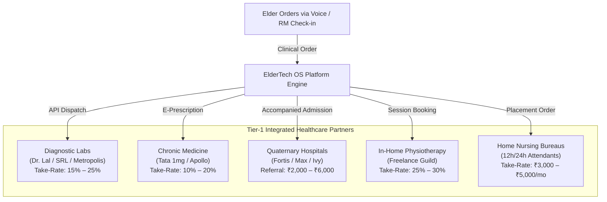

# Chapter 6: Ecosystem Monetization & Brand Integrations Beyond Subscriptions

## 6.1 The Macro Revenue Architecture

While monthly membership subscriptions (Silver, Gold, Platinum) establish predictable recurring revenue, the true economic scale of an enterprise eldercare operating system lies in **monetizing the elder’s entire household spend and clinical lifecycle**.

As the trusted daily interface for affluent, solitary seniors and their overseas NRI sponsors, the platform commands an unprecedented **high-intent distribution channel**.

```
┌────────────────────────────────────────────────────────────────────────────────────────┐
│                        ECOSYSTEM MONETIZATION SPECTRUM                                 │
├──────────────────────────┬─────────────────────────────┬───────────────────────────────┤
│ 1. Clinical Health       │ 2. Household & E-Commerce   │ 3. High-Ticket NRI Concierge │
│ • Diagnostic Lab Margins │ • Daily Grocery Errands     │ • Real Estate Property Defense│
│ • Hospital Referrals     │ • Mobility & Cab Bookings   │ • Wills, Trusts & Probate     │
│ • Chronic Med Margins    │ • Assistive Device Hardware │ • Memoir Book Publishing      │
│ • Home Nursing Placement │ • Home Safety Retrofits     │ • Insurtech Data Underwriting │
└──────────────────────────┴─────────────────────────────┴───────────────────────────────┘
```

---

## 6.2 Healthcare Services Integration (Commissions & Referral Take-Rates)

Healthcare spending in geriatric populations is non-discretionary. By integrating verified healthcare providers into Sarthi AI and the RM operational console, the platform captures substantial B2B referral revenue:



### 6.2.1 Diagnostic Laboratory Test Margins (15% to 25%)
* **The Opportunity:** Seniors with chronic comorbidities (diabetes, hypertension, kidney disease) require quarterly blood draws (HbA1c, lipid profiles, kidney function tests, thyroid panels).
* **Integration Partner:** Direct B2B API integrations with accredited diagnostic chains (Dr. Lal PathLabs, SRL Diagnostics, Metropolis Healthcare, Max Labs).
* **Economic Unit Margin:** 
  - An average quarterly geriatric health checkup package retails for **₹2,500 to ₹4,500**.
  - Commercial B2B lab agreements offer the platform a **15% to 25% commission take-rate**.
  - *Net Revenue:* **₹400 to ₹1,100 per test booking**, fulfilled seamlessly via in-home phlebotomists.

---

### 6.2.2 Chronic Prescription Medicine Replenishment (10% to 20%)
* **The Opportunity:** Elderly patients consume an average of 4 to 8 prescription medications daily for life. Medication adherence re-orders occur on a strict 30-day recurring cycle.
* **Integration Partner:** Seamless e-prescription routing through digital pharmacy networks (Tata 1mg, Apollo Pharmacy, MedPlus) combined with trusted local sector chemists for emergency 1-hour delivery.
* **Economic Unit Margin:**
  - Average monthly chronic prescription spend per senior: **₹3,000 to ₹7,000**.
  - Wholesale pharmacy margins generate a **10% to 20% recurring affiliate margin**.
  - *Net Recurring Revenue:* **₹300 to ₹1,400 per elder per month** with zero marketing spend.

---

### 6.2.3 Quaternary Hospital OPD & IPD Coordination Fees
* **The Opportunity:** Private tertiary and quaternary hospitals (such as Fortis Hospital Mohali, Max Super Speciality Hospital Mohali, and Grecian Hospital) spend huge budgets on patient acquisition. Furthermore, seniors often delay elective surgeries (knee replacements, cataract removals, cardiac stenting) because they have no one to navigate the hospital stay.
* **The Service:** The platform provides end-to-end hospital navigation: pre-op escort, admission desk coordination, bedside RM visits, and post-discharge home transition.
* **Economic Referral Structure:**
  - Hospital Patient Care Coordination fee: **₹2,000 to ₹6,000 per verified surgical or inpatient admission (IPD)**, compliant with Indian healthcare referral frameworks.

---

### 6.2.4 Geriatric Attendant & Clinical Home Nursing Placement
* **The Opportunity:** When an active elder experiences acute functional decline (e.g., following a hip fracture or stroke), the family desperately needs a full-time General Duty Attendant (GDA) or registered nurse (12h or 24h shift).
* **The Service:** The RM sources, verifies, and audits attendants from certified partner bureaus.
* **Economic Unit Margin:**
  - Standard monthly attendant cost: **₹20,000 to ₹35,000/month**.
  - Platform placement and quality-audit fee: **₹3,000 to ₹5,000 per month** throughout the duration of the patient's care.

---

## 6.3 E-Commerce Errands & Daily Household Commissions

As the voice interface of the home, Sarthi AI commands everyday purchasing decisions:

| Commercial Integration | Integration Mechanism | Transaction Volume / Basket Size | Platform Commission Take-Rate |
| :--- | :--- | :--- | :--- |
| **Daily Grocery & Essentials** | Direct API with Quick-Commerce (Blinkit / Zepto / Local Kirana) | ₹1,500 – ₹3,000 weekly grocery baskets | **5% to 8% affiliate margin** |
| **Accompanied Mobility & Cabs** | Integrated dispatch with Uber / Ola / Fleet partnerships | ₹300 – ₹600 per accompanied outing | **10% platform facilitation fee** |
| **Assistive & Mobility Devices** | Wheelchairs, walkers, digital BP monitors, hearing aid batteries | ₹2,000 – ₹15,000 per hardware unit | **15% to 25% direct distributor margin** |
| **Home Age-Proofing Retrofits** | Anti-skid bathroom tiles, grab bars, stair rails, motion sensors | ₹25,000 – ₹75,000 per home retrofit contract | **20% contractor referral margin (₹5k–₹15k)** |

---

## 6.4 High-Ticket NRI Diaspora Concierge (Legal, Real Estate & Tax)

One of the largest untapped profit centers in the NRI eldercare corridor is **cross-border property defense and legal governance**.

### 6.4.1 The Real Estate Security Dilemma in Tricity
* **The Reality:** A 1-kanal (500 sq. yard) luxury house in Chandigarh Sectors 8, 9, 10 or Mohali Phase 7 is worth between **₹8 Crore and ₹20 Crore ($1M to $2.5M USD)**.
* **The Anxiety:** NRI adult children in Canada and the UK live in perpetual fear of:
  - Illegal property encroachment and fraudulent tenant possession.
  - Municipal house tax arrears and utility disconnections.
  - Complicated legal inheritance, power of attorney (POA) disputes, and Indian probate courts.

### 6.4.2 High-Ticket Legal Concierge Packages
The platform partners with verified senior advocates and chartered accountants to deliver:
1. **Quarterly Physical Property Audits:** Perimeter inspections, boundary photography, and municipal tax clearance certificates sent to overseas children $\to$ **₹15,000 / year**.
2. **Estate Planning & Will Drafting:** Formal legal registration of wills, testamentary trusts, and medical powers of attorney $\to$ **₹25,000 to ₹50,000 per engagement**.
3. **Property Sale & Asset Liquidation Concierge:** Assisting the family in safely liquidating Indian real estate assets and repatriating foreign exchange under RBI Liberalised Remittance Scheme (LRS) rules $\to$ **1% to 1.5% transaction advisory fee**.

---

## 6.5 Creative Non-Subscription Revenue Streams

```
┌────────────────────────────────────────────────────────────────────────────────────────┐
│                        CREATIVE MONETIZATION PORTFOLIO                                 │
├────────────────────────────────────────────────────────────────────────────────────────┤
│ 1. "Silver Legacy" Memoir Publishing (₹15,000 – ₹25,000 per book)                      │
│ • Sarthi AI transcribes weekly oral memories into a hardbound autobiographical book.   │
│ • High emotional gift purchased eagerly by NRI grandchildren for milestone birthdays.  │
├────────────────────────────────────────────────────────────────────────────────────────┤
│ 2. Actuarial Insurtech Partnerships (B2B Health Insurance Telemetry)                   │
│ • Health insurers (Star Health, Care Health, HDFC ERGO) suffer massive loss ratios on  │
│   senior citizens (>120% loss ratio).                                                  │
│ • Our platform proves daily medication adherence, mobility, and early health alerts.   │
│ • Insurers sponsor platform memberships or pay a data integration fee to lower claims.│
├────────────────────────────────────────────────────────────────────────────────────────┤
│ 3. B2G Municipal Welfare Contracts (Public Sector Expansion)                           │
│ • Replicating South Korea's Naver CareCall model with Indian municipal corporations     │
│   (Chandigarh Municipal Corporation, GMADA Mohali).                                    │
│ • Government welfare grants paid per senior per month for telephone check-ins.         │
└────────────────────────────────────────────────────────────────────────────────────────┘
```

---

## 6.6 The Total Customer Lifetime Value (LTV) Expansion

By integrating these secondary and tertiary revenue streams, the Average Revenue Per User (ARPU) expands dramatically beyond basic subscription dues:

```
┌────────────────────────────────────────────────────────────────────────────────────────┐
│                         MONTHLY ARPU EXPANSION MODEL                                   │
├────────────────────────────────────────────────────────┬───────────────────────────────┤
│ Revenue Stream Component                               │ Monthly Net Revenue to Platform│
├────────────────────────────────────────────────────────┼───────────────────────────────┤
│ Base Hybrid Membership Retainer (Gold / Platinum Tier) │ ₹6,500 – ₹12,000              │
│ Diagnostic Lab Margins (Quarterly tests normalized)    │ ₹350                          │
│ Pharmacy Chronic Prescription Take-Rate                │ ₹650                          │
│ Hospital OPD & Escort Bookings (1–2 visits/month)      │ ₹1,200                        │
│ Household E-Commerce Errands (Groceries & Transport)   │ ₹450                          │
│ NRI Property & Legal Retainer (Amortized annually)     │ ₹1,500                        │
├────────────────────────────────────────────────────────┼───────────────────────────────┤
│ TOTAL REALIZED MONTHLY ARPU PER SUBSCRIBER             │ ₹10,650 – ₹16,150             │
└────────────────────────────────────────────────────────┴───────────────────────────────┘
```

---

:::tip[Next Chapter]
Examine the operational defense in **[Chapter 7: Architectural Stress-Testing — The 7 Loopholes & Patches](/gcfp/book/07-stress-testing-and-loopholes/)**.
:::
