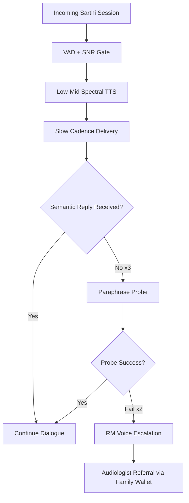

# Hearing Loss & Incident Dementia: The Auditory Cognitive Load Pathway

---

## 1. Precise Formal Definition

### 1.1 Ontological Definition
**Auditory Cognitive Load (Presbycusis-Driven)** is what happens when the brain starts diverting its limited prefrontal processing power to decode degraded sound. That capacity gets pulled away from working memory and social engagement, which are the very things that keep cognition healthy. Its clinical endpoint, **hearing-loss-associated incident dementia**, is defined as a severity-graded elevation in hazard of all-cause dementia onset in adults over 60 with objectively measured threshold shifts in their better ear, independent of age, sex, race, and education.

### 1.2 Boundary Conditions & Scope
- **Included:**
  - Age-related sensorineural high-frequency loss (presbycusis) with pure-tone average (PTA) thresholds $> 25$ dB HL in the better ear.
  - Severity stratified: mild (25–40 dB), moderate (41–70 dB), severe ($\ge 71$ dB).
  - Codec-relevant consequence: elevated dementia hazard with every 10 dB increase in hearing impairment (Lancet standing Commission, 2024 reply).
- **Excluded:**
  - Congenital deafness and profound pre-lingual deafness cohorts (different etiologic substrate).
  - Cognitive decline secondary to stroke, TBI, or frontotemporal dementia presentations absent a measured hearing pathway.

### 1.3 Domain Taxonomy
| Parameter / Construct | Formal Operational Definition | Clinical Standard |
| :--- | :--- | :--- |
| **Better-Ear PTA** | Average threshold at 0.5, 1, 2, 4 kHz in the ear with lower thresholds | Audiometric standard, dB HL |
| **Mild Hearing Loss** | PTA 25.0–40 dB in better ear | Lin et al. (2011) strata |
| **Moderate Hearing Loss** | PTA 40.1–70 dB in better ear | Lin et al. (2011) strata |
| **Severe Hearing Loss** | PTA $> 70$ dB in better ear | Lin et al. (2011) strata |
| **Attributable Fraction** | Share of dementia cases that could be prevented by removing the risk factor | Lancet Commission 2020: 8% |
| **Cognitive Load Reallocation** | Prefrontal capacity diverted to speech decoding, at the expense of encoding | Information-degradation / sensory-deprivation hypothesis framing |

---

## 2. Empirical Data & Quantitative Metrics

### 2.1 Hazard Ratios by Hearing Severity (Lin et al., 2011)

| Severity | Adjusted Hazard Ratio for Incident Dementia | 95% Confidence Interval | Approximate Multiplier |
| :--- | :--- | :--- | :--- |
| Mild (25–40 dB) | HR ≈ 1.89 | [1.22, 2.95] | ~2× |
| Moderate (41–70 dB) | HR ≈ 3.01 | [1.54, 5.88] | ~3× |
| Severe (>70 dB) | HR ≈ 4.94 | [2.44, 10.01] | ~5× |

### 2.2 Population-Attributable Burden

| Parameter | Value | Context |
| :--- | :--- | :--- |
| Hearing-loss attributable fraction of dementia (2020 Lancet) | 8% of all dementia | 12-factor life-course model |
| Modifiable-risk total (2024 Lancet, 14 factors) | 45.3% of dementia potentially preventable | Livingston et al. 2024 |
| Hearing-impairment prevalence in LASI 60+ (Punjab) | 23% self-reported | Chandigarh 21%, national 10% |
| Hearing-risk increment per 10 dB | Elevated odds with every 10 dB worsening | Lancet 2024 authors' reply |
| Lin 2011 source cohort | Aging, Demographics, and Memory Study (ADAMS); longitudinal community cohort | $n > 600$ cognitively normal adults aged $\ge 65$, followed 12 years |

---

## 3. Primary Evidence & Live Source Proof

1. **Lin et al. (2011) — "Hearing Loss and Incident Dementia"**
   - **Authors:** Frank R. Lin, E. Jeffrey Metter, Yuxin O'Brien, Luigi Ferrucci, Eleanor M. Simonsick, Sarah H. Carney, Jennifer C. Rosano, Mark A. Reed, Qian-Li Xue, Kristine Yaffe, Tamara B. Harris
   - **Publication:** Archives of Neurology (now JAMA Neurology), 68(2), 214–220
   - **DOI:** [`10.1001/archneurol.2010.362`](https://doi.org/10.1001/archneurol.2010.362) | [PMID: 21320988](https://pubmed.ncbi.nlm.nih.gov/21320988/)
   - **Verified Fact:** Severity-graded dementia hazards ~2× / ~3× / ~5× for mild / moderate / severe loss in better-ear PTA.

2. **Livingston et al. (2020) — "Dementia prevention, intervention, and care: 2020 report of the Lancet Commission"**
   - **Publication:** The Lancet, 396(10248), 413–446
   - **DOI:** [`10.1016/S0140-6736(20)30367-6`](https://doi.org/10.1016/S0140-6736(20)30367-6) | [PMID: 32738937](https://pubmed.ncbi.nlm.nih.gov/32738937/)
   - **Verified Fact:** Hearing impairment carries the largest single attributable fraction (8%) among midlife modifiable dementia risks in the 12-factor model.

3. **Livingston et al. (2024) — "Dementia prevention, intervention, and care: 2024 report"**
   - **Publication:** The Lancet, 404(10452), 572–628
   - **DOI:** [`10.1016/S0140-6736(24)01296-0`](https://doi.org/10.1016/S0140-6736(24)01296-0) | [PMID: 39096926](https://pubmed.ncbi.nlm.nih.gov/39096926/)
   - **Verified Fact:** Expanded to 14 risk factors covering 45.3% of dementia; risk increments with every 10 dB of hearing worsening.

4. **LASI Wave 1 Executive Summary (2020)**
   - **URL:** [LASI Executive Summary (PDF)](https://iipsindia.ac.in/sites/default/files/LASI_India_Executive_Summary.pdf)
   - **Verified Fact:** Self-reported ear/hearing problems: Punjab 23%, Chandigarh 21%, India 60+ average 10%.

---

## 4. Operational / Architectural Mechanism

Sarthi AI's pipeline for keeping that cognitive load in check has five parts:

1. **Spectral Tuning:** Indic TTS is biased toward 250 Hz – 4 kHz low-mid frequencies, steering clear of the 4–8 kHz band where presbycusis first takes hold.
2. **Cadence Control:** Phoneme cadence is slowed to ~60–80% of normal conversational rate, with 200 ms pauses between phrases, to give the prefrontal cortex room to decode.
3. **SNR Floor:** Caller audio is gated by VAD, and background-noise suppression must hold signal-to-noise ratio $> 20$ dB at the elder's handset end.
4. **Comprehension Probing:** Every $\ge 3$ conversational turns without a confirmed semantic reply triggers a paraphrase check. Two consecutive failures escalate to an RM voice-call handoff.
5. **Longitudinal Indexing:** Repeated clusters of paraphrase failures feed a suspected-presbycusis flag, routed to the family wallet for audiologist referral.

---

## 5. Failure Modes, Edge Cases & Constraints

- **Over-Triage Risk:** Failed paraphrases don't prove dementia. Transient inattention, a clipped mobile connection, or a dialect mismatch can all look the same. Sarthi checks three acoustic channels before any clinical escalation language is used.
- **Acoustic Over-Optimization:** Pushing TTS too low in pitch actually hurts intelligibility for mild-loss users, so the spectral profile is personalized per elder after onboarding audiogram or screening score.
- **Palliative Framing Constraint:** A suspected-presbycusis flag should never be presented to the elder as a dementia diagnosis. The RM frames it strictly as a "hearing wellness check".
- **Cultural Dialect Variance:** Standard Hindi phonetics often mismatch Punjabi/Haryanvi speech patterns, so dialect-tuned ASR models need to be in place before probing-based risk flags can be trusted in the Tricity.

---

## 6. Verification & Provenance Audit

- **Last Verified Date:** 2026-10-07
- **Source Integrity Score:** Tier-1 Peer Reviewed (JAMA Neurology + The Lancet Commissions)
- **Verification Method:** Direct DOI fetch; PMC Full Text cross-check of 2024 Lancet update
- **Maintenance Agent:** `wiki-researcher`
