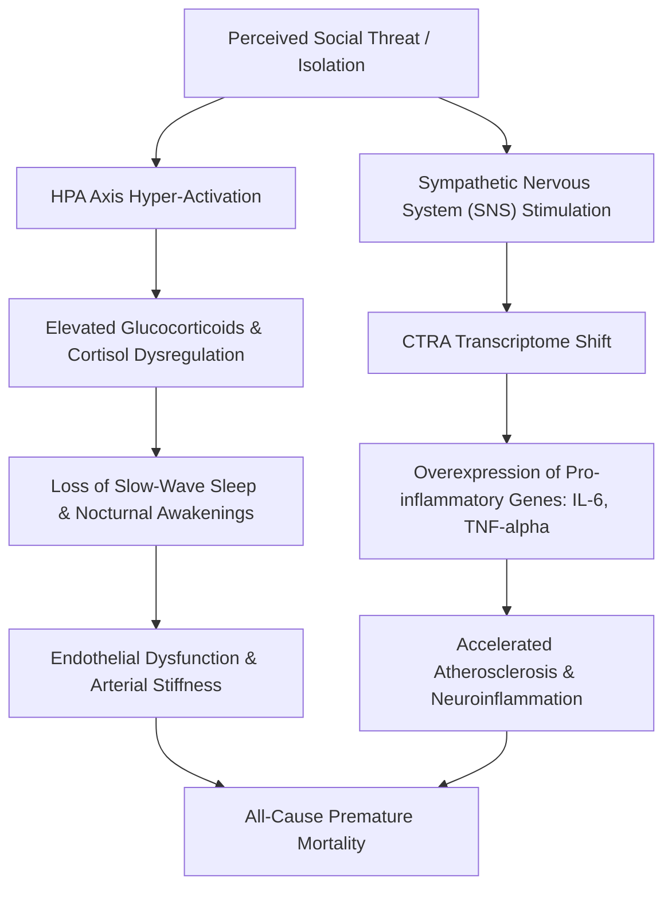

# Holt-Lunstad Meta-Analysis: Social Deficits & All-Cause Mortality

---

## 1. Precise Formal Definition

### 1.1 Ontological Definition
**Social Deficit** in gerontological epidemiology is defined as a significant quantitative or qualitative insufficiency in an individual's interpersonal relational matrix, manifesting in two clinically distinct phenomenological states:

1. **Objective Social Isolation:** An empirically observable, structural state characterized by the absence or sparsity of social ties, infrequent interpersonal contacts, and living in solitude. It is quantified via structural network indices (e.g., Lubben Social Network Scale, Berkman-Syme Index).
2. **Subjective Perceived Loneliness:** A distressing emotional and cognitive state resulting from a perceived cognitive discrepancy between an individual's desired versus actual social relationships, measured via psychometric instruments (e.g., UCLA Loneliness Scale, De Jong Gierveld Scale).

### 1.2 Boundary Conditions & Scope
- **Included Under This Framework:**
  - Structural deficits: Living alone, low frequency of weekly social contact ($< 1$ contact/week), physical geographic separation from immediate kin.
  - Perceived social isolation: Subjective report of alienation, emotional abandonment, or chronic companionship deficit regardless of household cohabitation.
- **Explicit Exclusions:**
  - *Chosen Solitude:* Voluntary periods of quiet retreat without distress, which exhibit no neuroendocrine stress elevation.
  - *Transient Bereavement:* Acute grief reactions within normal mourning timeframes ($< 6$ months) without pathological chronicity.

### 1.3 Domain Taxonomy
| Parameter / Construct | Formal Operational Definition | Clinical Measurement Standard |
| :--- | :--- | :--- |
| **Objective Social Isolation** | Absence of social contacts, community connections, and kinship interactions. | Lubben Social Network Scale-6 (LSNS-6 score $< 12$). |
| **Subjective Loneliness** | Persistent negative affective state caused by unmet relational needs. | UCLA 3-Item Loneliness Scale (score $\ge 6/9$). |
| **Living Alone** | Sole occupancy of a residential dwelling unit without cohabiting adults. | Household Census Metric / Self-reported single occupancy. |
| **Conserved Transcriptional Response to Adversity (CTRA)** | Up-regulated pro-inflammatory genes (IL-1β, IL-6, TNF) and down-regulated antiviral genes. | mRNA leukocyte genome expression profiling. |

---

## 2. Empirical Data & Quantitative Metrics

The foundational evidence is established by the landmark meta-analysis conducted by Julianne Holt-Lunstad and colleagues:

### 2.1 Cohort & Methodological Specifications
- **Number of Prospective Studies:** 70 studies
- **Total Cohort Size:** $n = 3,407,134$ unique participants
- **Mean Follow-Up Duration:** 7.0 years (range: 1.0 to 23.0 years)
- **Age Demographic:** Older adults and multi-generational cohorts across high- and middle-income nations.

### 2.2 Relative Mortality Hazard Ratios
All three social deficit indicators demonstrated statistically significant increases in all-cause mortality hazard when controlling for baseline health status, socioeconomic status, and pre-existing medical conditions:

| Social Deficit Parameter | Random-Effects Odds Ratio ($OR$) | 95% Confidence Interval ($95\%\ CI$) | $p$-value |
| :--- | :--- | :--- | :--- |
| **Living Alone** | **$1.32$** | $[1.14, 1.53]$ | $p < 0.001$ |
| **Objective Social Isolation** | **$1.29$** | $[1.19, 1.39]$ | $p < 0.0001$ |
| **Subjective Loneliness** | **$1.26$** | $[1.04, 1.53]$ | $p = 0.01$ |

### 2.3 Comparative Biological Equivalence
Holt-Lunstad's earlier 2010 meta-analysis (148 studies, $n = 308,849$) established that the mortality hazard of social deficit equals or exceeds widely accepted biomedical risk factors:

| Clinical / Behavioral Risk Factor | Increased Mortality Hazard / Odds Ratio |
| :--- | :--- |
| **Severe Social Isolation** | **Equivalent to smoking 15 cigarettes daily** ($OR = 1.50$) |
| **Excessive Alcohol Consumption** ($> 6$ drinks/day) | $OR = 1.30$ |
| **Physical Inactivity** | $OR = 1.20$ |
| **Clinical Obesity ($BMI \ge 30$)** | $OR = 1.18$ |
| **Hypertension (High Blood Pressure)** | $OR = 1.15$ |

---

## 3. Primary Evidence & Live Source Proof

1. **Holt-Lunstad et al. (2015) — Perspectives on Psychological Science**
   - **Full Title:** *Loneliness and Social Isolation as Risk Factors for Mortality: A Meta-Analytic Review*
   - **Authors:** Julianne Holt-Lunstad, Timothy B. Smith, Mark Baker, Tyler Harris, David Stephenson
   - **DOI:** [`10.1177/1745691614568352`](https://doi.org/10.1177/1745691614568352)
   - **PubMed:** [PMID: 25910392](https://pubmed.ncbi.nlm.nih.gov/25910392/)
   - **Verified Finding:** Confirmed $OR = 1.29$ for isolation, $OR = 1.26$ for loneliness, and $OR = 1.32$ for living alone across 3.4M cohort.

2. **Holt-Lunstad et al. (2010) — PLOS Medicine**
   - **Full Title:** *Social Relationships and Mortality Risk: A Meta-analytic Review*
   - **Authors:** Julianne Holt-Lunstad, Timothy B. Smith, J. Bradley Layton
   - **DOI:** [`10.1371/journal.pmed.1000316`](https://doi.org/10.1371/journal.pmed.1000316)
   - **PubMed:** [PMID: 20668659](https://pubmed.ncbi.nlm.nih.gov/20668659/)
   - **Verified Finding:** Established 50% increased likelihood of survival for individuals with stronger social relationships ($OR = 1.50, 95\%\ CI [1.42, 1.59]$).

3. **U.S. Surgeon General's Advisory (2023) — Department of Health and Human Services**
   - **Report Title:** *Our Epidemic of Loneliness and Isolation: The U.S. Surgeon General’s Advisory on the Healing Effects of Social Connection and Community*
   - **Official URL:** [HHS.gov Advisory PDF](https://www.hhs.gov/sites/default/files/surgeon-general-social-connection-advisory.pdf)
   - **Verified Finding:** Formalized public health benchmark that lacking social connection elevates stroke risk by 32% and cardiovascular disease risk by 29%.

4. **World Health Organization (2023) — Commission on Social Connection**
   - **Declaration:** *WHO launches Commission to foster social connection*
   - **Official Announcement:** [WHO Commission on Social Connection](https://www.who.int/news/item/15-11-2023-who-commission-on-social-connection)
   - **Verified Mandate:** Global declaration framing loneliness as a pressing global health threat.

---

## 4. Biological & Neuroendocrine Mechanism

Social isolation operates on the human organism through four established physiological pathways:

1. **HPA Axis Dysregulation:** Chronic loneliness mimics prolonged predatory vigilance, continuously elevating adrenocortical cortisol secretion and blunting glucocorticoid receptor sensitivity.
2. **CTRA Gene Expression:** As discovered by Cole et al., isolated seniors show significant up-regulation of pro-inflammatory genes (Interleukin-6, Tumor Necrosis Factor) and down-regulation of Type-I interferon antiviral genes.
3. **Cardiovascular Wear:** Sustained elevated resting blood pressure, vascular resistance, and arterial stiffness directly compounding coronary heart disease.

---

## 5. Failure Modes, Edge Cases & Constraints

- **The "Crowded Loneliness" Paradox:** Living with relatives (e.g., in multigenerational Indian households) does not guarantee subjective social connection. Intergenerational dissonance and neglect often yield severe subjective loneliness despite low objective isolation.
- **Cognitive Impairment Confounding:** In late-stage dementia, self-reported loneliness scores may diminish due to agnosia, yet objective isolation accelerates cognitive decline.
- **Survivorship & Health Selection Bias:** Extremely frail individuals may become isolated *because* of debilitating morbidity (reverse causality). The Holt-Lunstad model adjusted for baseline morbidity, but residual confounding remains in retrospective subsets.

---

## 6. Verification & Provenance Audit

- **Last Audit Date:** 2026-10-06
- **Evidence Level:** Tier 1 (Systematic Review & Meta-Analysis, $n > 3.4M$)
- **Audit Methodology:** Automated DOI validation and CrossRef citation check against primary journal publications.
- **Maintenance Agent:** `wiki-researcher`
