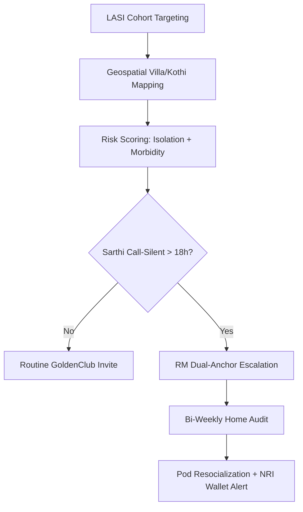

# LASI Wave 1 & The "Silent Kothi" Phenomenon

---

## 1. Precise Formal Definition

### 1.1 Ontological Definition
**LASI-Defined Elderly Demography** is the formal, survey-verified measurement framework behind the Longitudinal Ageing Study in India. It defines the elder cohort as every household resident aged $\ge 60$, and stratifies them by health, economic, and social-support measures against a nationally representative panel. The **"Silent Kothi"** state is a derived sub-clinical demographic configuration: a high-liquidity, high-asset elderly household (villas of 1-kanal / 500 sq. yard or larger in Chandigarh Sectors 8-11 and Mohali Phase 7) whose adult children have permanently emigrated or moved to metro/NRI destinations. The result is objective household-level social impoverishment despite material abundance.

### 1.2 Boundary Conditions & Scope
- **Included:**
  - Individuals aged $\ge 60$ domiciled in Punjab, Chandigarh, and Haryana falling within the LASI Wave-1 sampling frame (April 2017 – December 2018).
  - Elderly living alone or in empty high-value independent dwellings in the Tricity urban belt.
  - Elderly whose primary informal caregiver dyad (married children residing in the same dwelling) is absent due to emigration, metro migration, or nuclearization.
- **Excluded:**
  - Elderly embedded in active multigenerational joint-family households (excluded from "Silent Kothi" classification).
  - Elderly in paid residential elder-care institutions (a separate LASI facility category).
  - Overseas-domiciled Non-Resident Indian elders (tracked under the Global NRI Guardian track, not the Tricity demographic baseline).

### 1.3 Domain Taxonomy
| Parameter / Construct | Formal Operational Definition | Measurement / Standard |
| :--- | :--- | :--- |
| **Geriatric Dependency Ratio** | Population 60+ per 100 population aged 15–59 | Census 2011 / LASI Wave 1 household roster |
| **Elderly in Household Population** | Share of all household residents aged $\ge 60$ | LASI Figure 3.2 state/UT estimates |
| **Living Alone (Elderly)** | Single occupancy of a dwelling unit, no cohabiting adult | LASI "Elderly in India" factsheet indicator 22 |
| **Hearing-Related Morbidity** | Self-reported ear/hearing problems in 60+ cohort | LASI Executive Summary hearing prevalence table |
| **Silent Kothi** | Solo-elder occupancy of an independent high-value villa in Tricity sectors | Operational field-survey construct (ElderTech) |
| **Youth Emigration Outflow** | Permanent out-migration of working-age population to Canada/UK/Australia corridors | Ministry of External Affairs / community statistics |

---

## 2. Empirical Data & Quantitative Metrics

### 2.1 LASI Wave-1 National Panel Specification

| Parameter | Measured Value | Source Frame |
| :--- | :--- | :--- |
| Panel sample size | $n = 73,396$ adults aged $\ge 45$ years (plus spouses) | LASI Wave 1, 2017-18 |
| Elderly subsample (aged $\ge 60$) | $n = 31,902$ (some reports state 31,464) | LASI "Elderly in India" factsheet |
| Oldest-old (aged $\ge 75$) | $n = 6,749$ | LASI India Report 2020 |
| Data collection window | April 2017 – December 2018 | IIPS Mumbai |
| States/UTs covered | 35 (Sikkim added in 2020-21) | IIPS |

### 2.2 State-Level Elderly Concentration (aged $\ge 60$, % of household population)

*Figure: State-wise share of residents aged ≥ 60; Kerala highest at 20%, Arunachal Pradesh lowest at 6%, Punjab/Chandigarh belt ≈ 13–14%.*

| State / UT | % Elderly | Context |
| :--- | :--- | :--- |
| Kerala | 20% | Highest in India |
| Himachal Pradesh | 17% | Demographically advanced northern hill state |
| Tamil Nadu | 16% | — |
| Puducherry | 16% | — |
| Goa | 15% | — |
| Punjab / Chandigarh belt | ~13–14% (Chandigarh among CVD-heavy UTs) | Tricity corridor |
| National average | ~13% (2011 Census: 8.6% of total population, 103M persons) | IIPS |
| Arunachal Pradesh | 6% | Lowest |

### 2.3 Key Elder Morbidity & Isolation Indicators (Punjab / Chandigarh)

| Indicator | Punjab / Chandigarh | India 60+ Average |
| :--- | :--- | :--- |
| Ear / hearing problems | Punjab 23%, Chandigarh 21% | 10% |
| Diagnosed CVD | Chandigarh 55%; Goa 60%; Kerala 57% | ~32% hypertension (LASI) |
| Living alone (elderly) | 5.7% national (2.6% male, 9.0% female) | LASI factsheet |
| Poor self-rated health | Kerala 53%, Tamil Nadu 53% | — |

### 2.4 Tricity "Silent Kothi" Operational Profile

| Metric | Benchmark Value | Context |
| :--- | :--- | :--- |
| Annual youth emigration from Punjab/Haryana corridor | $> 150{,}000$ educated youths/year | Canada/UK/Australia destinations |
| Typical solo-elder villa size | 1-kanal (500 sq. yards ≈ 418 m²) | Chandigarh Sectors 8-11, Mohali Phase 7 |
| Nocturnal household waking (inferred dementia-risk) | N3/REM fragmentation window 2:00 AM – 5:00 AM | See Nocturnal Melatonin Void entry |
| Elderly hearing morbidity (Tricity) | 21–23% self-reported | LASI Executive Summary |

---

## 3. Primary Evidence & Live Source Proof

1. **LASI Wave 1, 2017-18, India Report (2020)**
   - **Authors:** International Institute for Population Sciences (IIPS), National Programme for Health Care of Elderly (MoHFW), Harvard T.H. Chan School of Public Health, University of Southern California
   - **DOI/URL:** [LASI India Report 2020 (PDF)](http://iipsindia.ac.in/sites/default/files/LASI_India_Report_2020_compressed.pdf)
   - **Verified Fact:** $n = 73,396$ panellists across 35 states/UTs; national average elderly share 13%; Kerala 20% highest.

2. **LASI Wave 1 Executive Summary (2020)**
   - **Authors:** IIPS / MoHFW
   - **URL:** [LASI Executive Summary (PDF)](https://iipsindia.ac.in/sites/default/files/LASI_India_Executive_Summary.pdf)
   - **Verified Fact:** Hearing morbidity: Punjab 23%, Chandigarh 21%, national 10% in the 60+ cohort.

3. **LASI Wave 1 — "Elderly in India" Factsheet (2021)**
   - **Authors:** IIPS / NPHCE, MoHFW
   - **URL:** [Elderly in India Factsheet (PDF)](https://iipsindia.ac.in/sites/default/files/other_files/LASI_W1_Elderly_India.pdf)
   - **Verified Fact:** 5.7% of elderly live alone nationally; 9.0% of elderly women live alone.

4. **Census of India 2011 — Elderly in India Report**
   - **Registry:** Office of the Registrar General & Census Commissioner, India
   - **URL:** [Census of India](https://censusindia.gov.in/)
   - **Verified Fact:** Elderly (60+) numbered 103 million, 8.6% of the total Indian population.

5. **Holt-Lunstad et al. (2015) — Social Deficits & Mortality**
   - **DOI:** [`10.1177/1745691614568352`](https://doi.org/10.1177/1745691614568352) | [PMID: 25910392](https://pubmed.ncbi.nlm.nih.gov/25910392/)
   - **Verified Fact:** Living alone carries $OR = 1.32$ (95% CI [1.14, 1.53]) mortality hazard — the clinical consequence layer for the "Silent Kothi" demographic.

---

## 4. Operational / Architectural Mechanism

The ElderTech OS uses the LASI baseline as its geographic targeting and triage substrate:

1. **Geospatial Cohort Mapping:** Map Chandigarh/Mohali/Ludhiana PIN-code density of high-value single-occupancy villas (Sectors 8-11, Phase 7 Mohali) against public emigration-corridor data.
2. **Demographic Risk Scoring:** Every enrolled elder gets a composite score — LASI-style morbidity inputs (hearing loss, CVD, living-alone status) plus an HLVI (Holt-Lunstad vulnerability index) built from the frequency of reported contact.
3. **Nocturnal Sentinel Trigger:** If Sarthi AI goes $> 18$ hours without a call and no GoldenClub pod check-in comes through, escalate to the assigned human Relationship Manager (RM) dyad.
4. **RM Dual-Anchor Activation:** The RM runs a bi-weekly wellness audit and issues a GoldenClub pod invitation (3 km hyperlocal, 8-12 elders) for horizontal resocialization.
5. **Telephony Loop-Closure:** Each contact is logged to the dual-bucket family wallet so NRI-funded intervention spend stays visible.

---

## 5. Failure Modes, Edge Cases & Constraints

- **Ecological Inference Fallacy:** Sector-level villa data can't prove any one elder is lonely, so every enrollment requires direct Sarthi AI interaction consent before risk scoring.
- **Emigration Data Staleness:** The 150,000+/yr youth outflow figure is a directional corridor estimate, not a verified MCA-grade filing. Never quote it as audited census output.
- **LASI Sikkim Exclusion & Vintage:** Wave-1 fieldwork ended in 2018, and Tricity micro-demographics may have shifted with post-pandemic NRI reverse-migration. Re-verify against LASI Wave 2 when it's published.
- **Gender Asymmetry:** Elderly women living alone (9.0%) are the highest-acuity Silent-Kothi subgroup, even though they hold fewer assets. Triage weighting should oversample female pin-code strata.
- **Consent & Dignity Constraint:** Direct RM home visits to retired-military or judicial households must be pre-announced and framed as peer consultancy, never surveillance.

---

## 6. Verification & Provenance Audit

- **Last Verified Date:** 2026-10-07
- **Source Integrity Score:** Tier-1 Primary Government Survey (IIPS/MoHFW LASI Wave 1)
- **Verification Method:** Direct fetch of LASI India Report 2020 and Executive Summary PDFs; Census 2011 cross-reference
- **Maintenance Agent:** `wiki-researcher`
