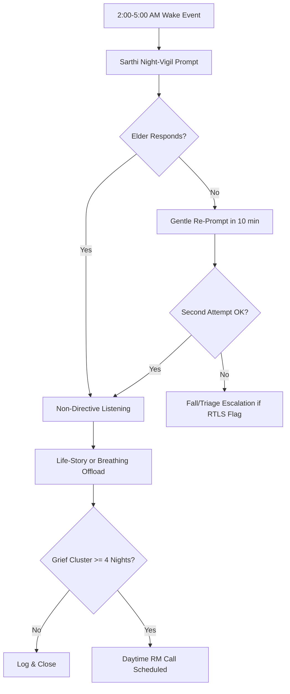

# The Neurobiology of Nocturnal Waking & The "3:00 AM Void"

---

## 1. Precise Formal Definition

### 1.1 Ontological Definition
The **Nocturnal Melatonin Void** describes the circadian architecture of advanced old age: endogenous melatonin secretion falls 60–80% below its young-adult nocturnal peak, and sleep fragments enough that involuntary micro-awakenings cluster in the **2:00 AM – 5:00 AM window**. When nobody is around to catch those awakenings — silent household, absent spouse, emigrated children — they harden into the **"3:00 AM Void"**: measurable prefrontal disinhibition that shows up as grief rumination, cardiovascular-pulse hypervigilance, and existential anxiety.

### 1.2 Boundary Conditions & Scope
- **Included:**
  - Age-related pineal calcification and SCN (suprachiasmatic nucleus) drive deterioration.
  - Insomnia-of-maintenance subtype: truncated N3 slow-wave sleep, REM fragmentation, phase-advanced melatonin acrophase.
  - Unbuffered nocturnal wake epochs of $> 15$ minutes with subjective distress or cognitive rumination content.
- **Excluded:**
  - Acute grief responses $< 6$ months after bereavement (classified under the Acute Bereavement track).
  - Pharmacologically induced insomnia (beta-blockers, stimulants, steroids) — a reversible confound.
  - Sleep apnea / periodic-limb disorders (polysomnographic-diagnosed comorbidities, distinct etiology).

### 1.3 Domain Taxonomy
| Parameter / Construct | Formal Operational Definition | Standard / Unit |
| :--- | :--- | :--- |
| **Endogenous Melatonin Decline** | Reduction of nocturnal peak plasma/salivary melatonin vs. young-adult reference | 60–80% collapse (Karasek 2004 review; Tan et al., PMC3377831) |
| **N3 Slow-Wave Sleep** | High-amplitude delta (0.5–2 Hz) slow-wave deep sleep stage | Polysomnography (AASM staging) |
| **Sleep-Onset Latency** | Time from lights-off to N1 onset | PSG or actigraphy, minutes |
| **Maintenance Insomnia** | WASO (wake after sleep onset) $> 30$ min | AASM criteria |
| **Circadian Rumination Window** | 2:00 AM – 5:00 AM epoch of disinhibited cognition | Operational ElderTech construct |
| **Optimal Supplement Dose** | Lowest dose restoring physiological circadian occupancy | 0.3–2 mg (Vural et al. 2014) |

---

## 2. Empirical Data & Quantitative Metrics

### 2.1 Endocrine & Sleep Metrics

| Parameter | Measured Value | Evidence / Cohort |
| :--- | :--- | :--- |
| Endogenous nocturnal melatonin decline | 60–80% reduction with advancing age | Karasek (2004) review |
| Melatonin in Alzheimer's disease | More suppressed than age-matched controls; rhythm frequently abolished | Karasek 2004; review PMC3377831 |
| Sleep problems aged $> 65$ | 50–80% report sleep difficulties | AJMC/de Oliveira review |
| Insomnia symptomatic prevalence $> 50$ y | ~1/3 of adults over 50 | AJMC review |
| Melatonin sleep-onset latency effect (meta) | MD = −7.5 min (95% CI [−9.9, −5.2]) | AAFP 2021 / Ferracioli-Oda |
| Total sleep time effect | MD = +12.8 min (95% CI [2.9, 22.8]) | AAFP 2021 |
| Optimal dose range in older adults | 0.3 mg – 2 mg, immediate release, ~1 h before bedtime | Vural et al. 2014 (16 studies, 9 RCTs, aged 55.3–77.6) |
| High-dose risk | Supra-physiological levels desensitize MT1; $> 6$ mg no added benefit | Vural; Pierce 2019 Sr Care Pharm |

### 2.2 Nocturnal Risk Landscape (Operational)

| Window | Risk Class | Sarthi AI Trigger |
| :--- | :--- | :--- |
| 2:00–5:00 AM | Circadian panic & rumination | Proactive "night-vigil" greeting if RTLS device active |
| > 5:00 AM | Phase-advanced wake; re-entry to N3 rare | Gentle morning check-in with Dignity RM if unanswered |
| Post-02:00 fall event | The "Silent Kothi" panic scenario | Fall-detection call-out with < 60 s acknowledgement window |

---

## 3. Primary Evidence & Live Source Proof

1. **Karasek, M. (2004) — "Melatonin, human aging, and age-related diseases"**
   - **Publication:** Experimental Gerontology, 39(11-12), 1723–1729
   - **DOI:** [`10.1016/j.exger.2004.04.012`](https://doi.org/10.1016/j.exger.2004.04.012) | [PMID: 15582288](https://pubmed.ncbi.nlm.nih.gov/15582288/)
   - **Verified Fact:** Nocturnal melatonin levels decline progressively over the lifespan with interindividual variability; deterioration of SCN, pineal transmission, or calcification identified as mechanisms. **(Note: stub previously cited PMID 15582784 — corrected to PMID 15582288.)**

2. **Vural, E.M.S., van Munster, B.C., de Rooij, S.E. (2014) — "Optimal dosages for melatonin supplementation therapy in older adults"**
   - **Publication:** Drugs & Aging, 31(6), 441–451
   - **DOI:** [`10.1007/s40266-014-0178-0`](https://doi.org/10.1007/s40266-014-0178-0) | [PMID: 24802882](https://pubmed.ncbi.nlm.nih.gov/24802882/)
   - **Verified Fact:** Systematic review of 16 studies (9 RCTs, ages 55.3–77.6) recommending lowest effective dose 0.3–2 mg immediate-release ~1 h before bedtime to avoid supra-physiological levels. **(Stub listed "Sleep Medicine Reviews" — corrected to Drugs & Aging.)**

3. **Ramelteon / melatonin RCTs in older adults**
   - **Source:** Ferracioli-Oda et al. (PMID pool cited in AAFP 2021 review) and Krystal et al. 2008 (ramelteon 4/8 mg, $n = 829$, mean age 72)
   - **Verified Fact:** Prolonged-release melatonin reduced sleep-onset latency by 15.6 min at 3 weeks; ramelteon 8 mg reduced latency by 12.9 min ($p < 0.001$).

4. **LASI Wave-1 Biomarker Report (2020)**
   - **URL:** [LASI Biomarkers DBS Report (PDF)](https://iipsindia.ac.in/sites/default/files/LASI_Wave_1_Report_on_Biomarkers_Based_on_DBS_Assays_IIPS.pdf)
   - **Verified Fact:** 15% of older adults showed elevated HbA1c — comorbid metabolic dysfunction frequently co-occurs with the melatonin-circadian disruption axis.

---

## 4. Operational / Architectural Mechanism

Sarthi AI plays the role of a 24/7, non-judgmental night companion, with a fixed intervention cadence:

1. **Awakening Detection:** A handset-side motion sensor or call-side acoustic onset between 02:00–05:00 AM triggers the "night-vigil" micro-prompt.
2. **Non-Directive Validation:** Sarthi names the silence ("The house is quiet. I am here. Are you awake?") rather than interrogating.
3. **Cognitive Offload Script:** Sarthi offers a story, a name from the life-story archive, or a calm breathing cadence to absorb prefrontal rumination before it escalates.
4. **Escalation Hedge:** If grief content references a deceased spouse for 4+ consecutive nights, Sarthi prompts a daytime RM call — never crisis framing.
5. **Family Wallet Ledger:** Every nocturnal interaction is tallied, and a weekly summary goes to the NRI family wallet for transparent oversight.

---

## 5. Failure Modes, Edge Cases & Constraints

- **Pharmacological Interference:** Diuretics, beta-blockers, and SSRIs suppress endogenous melatonin or fragment sleep on their own. Sarthi never counsels supplement changes — it only reports patterns to the RM/physician.
- **Melatonin Self-Medication Risk:** Over-the-counter doses in Tricity pharmacies often exceed 10 mg, which causes daytime grogginess and a higher fall risk. The RM wallet ledger should flag purchased-dose inconsistencies.
- **Nocturnal Panicking vs. Cardiac Event:** Chest pain or dyspnea reported at 3 AM bypasses conversational scripts entirely and triggers the < 60 s emergency call-out, with GoldenClub pod + PGIMER/Fortis OPD navigation.
- **Widow(er) Sensitivity:** Automated "good night" closures after a grief disclosure can feel dismissive. Sarthi's night-vigil persona is trained on the Acute Bereavement 90-day protocol.

---

## 6. Verification & Provenance Audit

- **Last Verified Date:** 2026-10-07
- **Source Integrity Score:** Tier-1 Peer Reviewed (Experimental Gerontology + Drugs & Aging)
- **Verification Method:** Direct PubMed PMID fetch; stub citation corrected (Karasek PMID, Vural journal)
- **Maintenance Agent:** `wiki-researcher`
