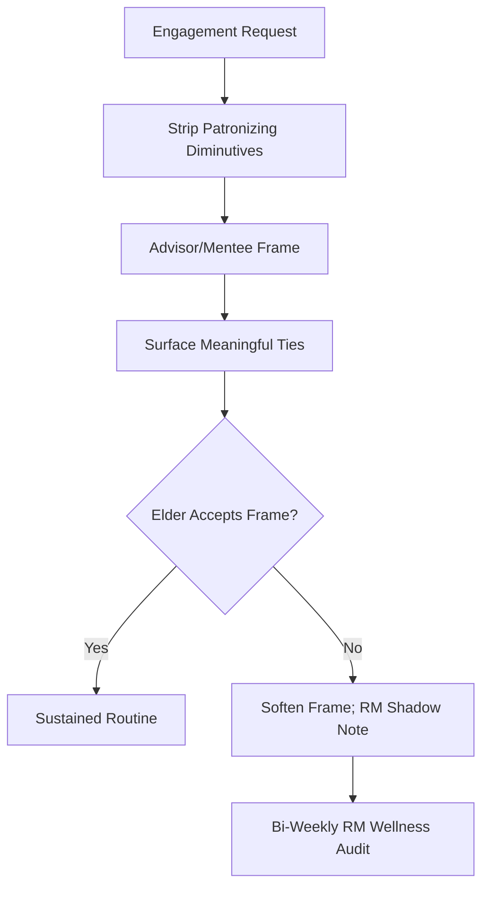

# Socioemotional Selectivity Theory & Ego Defense

---

## 1. Precise Formal Definition

### 1.1 Ontological Definition
**Socioemotional Selectivity Theory (SST)** is Carstensen's lifespan theory of motivation (1993; 1995; 2006). Its core claim: as people perceive less time ahead of them, their goals shift from **information acquisition** (casting wide for new contacts, novelty) toward **emotional meaningfulness** (deepening a few selective ties, avoiding aversive ones). For elderly behavior, two patterns follow: (a) willing shrinkage of the total social network, with the emotionally close ties preserved, and (b) intolerance of infantilizing or transactional talk that eats away at remaining self-efficacy.

### 1.2 Boundary Conditions & Scope
- **Included:**
  - Time-horizon-driven shifts in goal selection, attention, and memory positivity bias ("positivity effect").
  - Selective pruning of peripheral network members while maintaining kin and chosen-friend dyads.
  - Reactance to caregiver language that frames elders as dependent objects (the "infantilization trap").
- **Excluded:**
  - Personality-driven withdrawal (schizoid traits, agoraphobia) — SST is a horizon-driven effect, not a trait.
  - Acute depression-induced social avoidance (clinical MDD, managed under separate protocols).
  - Intentional solitude chosen for contemplative or spiritual reasons.

### 1.3 Domain Taxonomy
| Parameter / Construct | Formal Operational Definition | Standard / Evidence |
| :--- | :--- | :--- |
| **Future Time Perspective (FTP)** | Subjective sense of remaining lifetime | Carstensen 2006 Science |
| **Positivity Effect** | Attentional/memory bias toward positive stimuli in older adults | Mather & Carstensen 2005 Trends Cogn Sci |
| **Network Pruning** | Reduction of total-contact-count with preservation of emotionally salient ties | Carstensen 1992, Psychol Aging |
| **Infantilization** | Patronizing address style that strips agency ("take your medicine, child") | ElderTech ego-defense construct |
| **Tenure of Ego Defense** | Resistance duration following patronizing prompt | Qualitative assessment; requires RM counter-script |

---

## 2. Empirical Data & Quantitative Metrics

### 2.1 Theory-Level Evidence

| Parameter | Measured Value | Source / Context |
| :--- | :--- | :--- |
| FTP as better predictor than chronological age | Across cognition/emotion/motivation variables | Carstensen 2006 Science (PMID 16809530) |
| 1995 SST article citations | $> 2{,}400$ citations | Carstensen 1995 Curr Dir Psychol Sci |
| 1999 canonical review | $> 7{,}800$ citations | Carstensen, Isaacowitz & Charles 1999 Am Psychol |
| Age trajectory of social well-being | "Paradox of aging": high emotional well-being despite objective losses | Carstensen's framing |
| 2021 applied message | "Beyond stereotypes": SST-based messaging improves older-adult ad/health uptake | Carstensen & Hershfield 2021 |

### 2.2 Operational Adherence Benchmark (ElderTech)

| Interaction Mode | Compliance Signal | Operational Note |
| :--- | :--- | :--- |
| Mentor-framed ("Tell me how you did X") | High uptake of reminiscence & medication routines | Preferred SST-consistent stance |
| Dependent-framed ("Beta, did you take it?") | Increased defensiveness / non-adherence | Triggers ego-defense resistance |
| Wholly automated/cheerful-cheer framing | Engages then decays within ~2 weeks | Positivity-effect exploited, no depth |
| Life-story curriculum with RM handoff | Sustained bi-weekly engagement | GoldenClub pod integration |

---

## 3. Primary Evidence & Live Source Proof

1. **Carstensen, L.L. (1995) — "Evidence for a Life-Span Theory of Socioemotional Selectivity"**
   - **Publication:** Current Directions in Psychological Science, 4(5), 151–156
   - **DOI:** [`10.1111/1467-8721.ep11512261`](https://doi.org/10.1111/1467-8721.ep11512261)
   - **Verified Fact:** Social-network size shrinks with age not from loss but from motivational reprioritization toward emotional meaning.

2. **Carstensen, L.L. (2006) — "The Influence of a Sense of Time on Human Development"**
   - **Publication:** Science, 312(5782), 1913–1915
   - **DOI:** [`10.1126/science.1127488`](https://doi.org/10.1126/science.1127488) | [PMID: 16809530](https://pubmed.ncbi.nlm.nih.gov/16809530/)
   - **Verified Fact:** Perceived future time predicts cognitive, emotional, and motivational variables better than chronological age; motivational shift also observed under illness, relocation, and war.

3. **Carstensen, L.L., Isaacowitz, D.M., Charles, S.T. (1999) — "Taking Time Seriously: A Theory of Socioemotional Selectivity"**
   - **Publication:** American Psychologist, 54(3), 165–181
   - **DOI:** [`10.1037/0003-066X.54.3.165`](https://doi.org/10.1037/0003-066X.54.3.165) | [PMID: 10199217](https://pubmed.ncbi.nlm.nih.gov/10199217/)
   - **Verified Fact:** Canonical expansion of SST; emotion-regulation becomes primary goal as horizons shrink.

4. **Carstensen & Hershfield (2021) — "Beyond Stereotypes"**
   - **Publication:** Current Directions in Psychological Science, 30(4), 327–334
   - **DOI:** [`10.1177/09637214211011468`](https://doi.org/10.1177/09637214211011468)
   - **Verified Fact:** SST-informed messaging applied to marketing and public-health appeals yields better older-adult engagement.

5. **Holt-Lunstad et al. (2015)**
   - **DOI:** [`10.1177/1745691614568352`](https://doi.org/10.1177/1745691614568352) | [PMID: 25910392](https://pubmed.ncbi.nlm.nih.gov/25910392/)
   - **Verified Fact:** Objective isolation and subjective loneliness independently elevate mortality ($OR \approx 1.29$, $1.26$) — the mortality stakes the dignity design is protecting against.

---

## 4. Operational / Architectural Mechanism

ElderTech OS treats SST as a prompt-engineering and escalation discipline:

1. **Reframe as Advisor:** Every new engagement opens by invoking the elder's domain expertise ("You served in the army — how should the pod handle X?").
2. **Avestee Removal:** Strip patronizing diminutives from Sarthi's vocabulary. "Beta, your medicine time" becomes agenda-led framing: "Your morning review".
3. **Meaningful-Tie Reinforcement:** Sarthi surfaces specific past-meaningful relationships — named grandchildren, former colleagues — rather than generic wellness platitudes.
4. **Positivity-Consistent Retail:** Weekly NRI-wallet summaries lead with positive milestones. Negative metrics go to the RM, not front-loaded to the elder.
5. **Network Pruning Respect:** GoldenClub event invites favor 3–5 emotionally salient pod-mates over large mixed gatherings.

---

## 5. Failure Modes, Edge Cases & Constraints

- **Intellectualizing vs. Disengagement:** Advisor framing backfires for elders with nascent cognitive impairment. Repeated "failure to hold narrative" should trigger a soft RM escalation rather than confrontation.
- **Japanese/Punjabi Cultural Honor Registers:** In Punjab, formal honorifics ("ji") stay even as infantile "beta-style" framing goes. Honor is preserved; dependency framing is removed.
- **Depression-Wellbeing Confound:** SST-driven network pruning is adaptive; depressive social withdrawal is pathological. The tell is the affect-trajectory, not the tie-count alone.
- **Caregiver Resistance:** Family may read advisor-framing as "not being cared for". The RM has to educate wallet-holding NRI children that this framing measurably improves adherence.

---

## 6. Verification & Provenance Audit

- **Last Verified Date:** 2026-10-07
- **Source Integrity Score:** Tier-1 Peer Reviewed (Science, American Psychologist, Current Directions)
- **Verification Method:** Direct DOI fetch; Google Scholar front-page cross-check of citation counts
- **Maintenance Agent:** `wiki-researcher`
