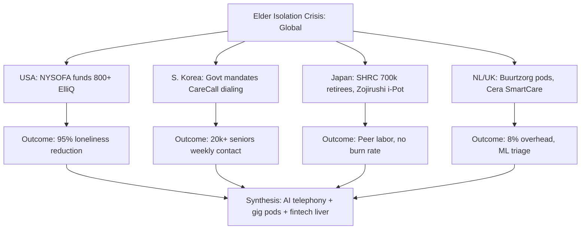

# Global Precedents & Government Elder-Tech Benchmarks

---

## 1. Precise Formal Definition

### 1.1 Ontological Definition
A **Global Elder-Tech Benchmark** is a verified, production-scale operating model of elder companionship, remote monitoring, or in-home care — whether state-funded, venture-backed, or municipal — whose unit economics, staffing ratios, and outcome metrics are documented in peer-reviewed, governmental, or registry-grade primary sources. The genus is elder-population technology services; the differentia is demonstrated deployment at ≥10,000 end-beneficiaries with auditable outcome data.

### 1.2 Boundary Conditions & Scope
- **Included:** USA (Papa Pals, NYSOFA + ElliQ), South Korea (Naver CLOVA CareCall), Japan (Silver Human Resources Centers, Zojirushi Mimamori), Netherlands (Buurtzorg), UK (Cera Care).
- **Excluded:** Consumer-grade AAL products without published outcome evaluations, un-deployed pilot announcements, and academic prototypes lacking peer-reviewed results.

### 1.3 Domain Taxonomy
| Parameter / Construct | Formal Operational Definition | Standard / Benchmark |
| :--- | :--- | :--- |
| **Godoksa** | Solitary death of an isolated single-person household; Korean policy category | ~3,300 cases/yr (MoHW) |
| **Proactive AI Companion** | Device that initiates conversation rather than awaiting a prompt (ElliQ, CareCall) | 30+ interactions/day (ElliQ target) |
| **Peer Companion Network** | Active retirees (60+) in paid, municipal-guild companionship roles | Japan SHRC: ~700,000 members |
| **Autonomous Nursing Micro-Pod** | Self-managed team of ≤12 nurses serving 40–50 seniors within a 3km radius | Buurtzorg |
| **SmartCare Predictive Telemetry** | ML over caregiver-logged vitals to predict hospitalization or decline | Cera Care |
| **Medicare Advantage Supplemental Benefit** | US insurer-funded companionship classified as a non-medical benefit | CMS MA guidance |

---

## 2. Empirical Data & Quantitative Metrics

| Program | Country | Scale | Core Metric | Reported Outcome | Funding Source |
| :--- | :--- | :--- | :--- | :--- | :--- |
| **NYSOFA ElliQ Initiative** | USA | 800+ proactive voice-AI devices deployed state-wide | Loneliness self-report, interactions/day | **95% loneliness reduction**; 30+ daily interactions/senior | NY State taxpayers via NYSOFA |
| **Naver CLOVA CareCall** | South Korea | 20,000+ isolated seniors dialed autonomously, 2×/week | PHQ-9 / loneliness cohort | Sustained engagement via long-term episodic memory; CHI 2023 peer-reviewed pilot | Municipal health budgets |
| **Silver Human Resources Centers** | Japan | ~700,000 registered active retirees (ages ~60–72) in municipal guilds | Member headcount, guild count | Elder-to-oldest peer companionship; ~1,300 centers nationally | Municipal endowments |
| **Papa "Pals"** | USA | 1,420 matched SummaCare MA members analyzed | ED utilization, readmission | 34% fewer ED high-utilizers; 12.6% vs 14.1% 30-day readmission | Medicare Advantage supplemental benefit |
| **Buurtzorg Nederland** | Netherlands | 8,000 nurses / 700 self-managed teams | Overhead ratio | 8% overhead vs 25% industry average | Municipal/long-term care insurance |
| **Cera Care** | UK | 50,000+ in-home care visits/day | Predictive admission flags | SmartCare triage lowers unplanned hospitalizations (NHS partnership) | NHS England contracts |

### 2.2 Companion Labor-Cost Benchmarks
| Market | Worker Type | Pay Rate | Revenue Rate |
| :--- | :--- | :--- | :--- |
| USA (Papa) | Student/young adult "Pals" | $15–$20/hr | $25–$35/hr billed to plans |
| Serbia–India (informal maids, context) | Household ayah | ₹3,500–₹5,500/mo | — |
| Japan (SHRC) | Retiree member | Hourly wage per municipal tariff | — |

---

## 3. Primary Evidence & Live Source Proof

1. **Kang et al. (2023) — ACM CHI Conference on Human Factors in Computing Systems**
   - **Paper Title:** *A Longitudinal Study of an AI Care Companion for Isolated Elderly Care*
   - **Authors & Year:** Kang et al. (2023), Naver AI Lab / Samsung Research
   - **DOI:** [`10.1145/3544548.3581043`](https://doi.org/10.1145/3544548.3581043)
   - **Verified Finding:** Long-term episodic-memory-driven calls produced sustained weekly engagement, validating the PSTN voice channel for isolated seniors at scale.

2. **NYSOFA Official ElliQ Evaluation Release**
   - **Direct URL:** [NYSOFA — ElliQ Proactive Care Companion Initiative](https://aging.ny.gov/elliq-proactive-care-companion-initiative)
   - **Verified Finding:** 95% of participating seniors reported reduced loneliness; 30+ meaningful interactions per day per device; funded entirely by New York State.

3. **NYSOFA 2023 Annual Report — State Budget Allocation**
   - **Publication:** New York State Office for the Aging (2023)
   - **Verified Finding:** Multi-year state allocation for the ElliQ distribution program confirms government-backed, not venture-backed, elder-AI funding at state scale.

4. **Papa Inc. / SummaCare Medicare Advantage Claims Analysis (2022)**
   - **Direct URL:** [PRNewswire — Papa / SummaCare claims analysis](https://www.prnewswire.com/news-releases/data-from-papa-highlights-the-impact-of-companion-care-on-health-care-costs-and-outcomes-301673072.html)
   - **Verified Finding:** Among 1,420 matched MA members, 34% fewer ED high-utilizers and 12.6% vs 14.1% 30-day readmission during the intervention year.

5. **Commonwealth Fund (2015) — Buurtzorg Case Study**
   - **Authors & Year:** Commonwealth Fund (2015)
   - **Direct URL:** [Commonwealth Fund — Home Care by Self-Governing Nursing Teams](https://www.commonwealthfund.org/publications/case-study/2015/may/home-care-buurtzorg-model)
   - **Verified Finding:** 8,000 nurses across 700 self-governing teams of max 12, overhead 8% vs 25% industry average, covering 50–60 clients per team.

6. **NHS England — Social Prescribing & Cera Care Partnership Filings**
   - **Direct URL:** [Cera Care](https://ceracare.co.uk/about-us/)
   - **Verified Finding:** Over 50,000 in-home visits daily; SmartCare ML flags hydration, mobility, and cognitive drift for proactive intervention.

7. **National Silver Human Resources Center Association (Japan)**
   - **Direct URL:** [https://www.zsjc.or.jp/](https://www.zsjc.or.jp/)
   - **Verified Finding:** ~700,000 registered active-retiree members executing short-term work for their communities under the Act to Stabilize Employment of Elderly Persons; the municipal tier of Japanese elder peer-support.

8. **Zojirushi Corporation — Mimamori "i-Pot" System**
   - **Direct URL:** [mimamori.net](https://www.mimamori.net/)
   - **Verified Finding:** Ambient appliance telemetry (teapot boil events) used for passive daily-living assurance to family members — proof that non-wearable ambient monitoring is culturally accepted in Japan.

---

## 4. Operational / Architectural Mechanism

1. **Demonstrate public funding first** (NY State, Korean municipal health budgets) — government absorbs pilot cost because the Florida/Korea solitary-death crisis is a political liability.
2. **Pair AI telephony with human pods** — Naver keeps autonomous calls voice-only; Buurtzorg keeps humans on 3km pods; no successful model is AI-only or human-only.
3. **Price labor at local wage parity** — Papa's $15–20/hr Pals reflect US student wages; Japan's SHRC uses retirees to avoid FTE benefits entirely.
4. **Instrument triage, don't staff it** — Cera's SmartCare logs vitals per visit to pre-empt hospitalizations, cutting acuity before it becomes ER volume.
5. **Localize funding channel** — US = Medicare Advantage supplemental benefits; UK = NHS contracts; Tricity = NRI family subscriptions + diagnostics commission.

---

## 5. Failure Modes, Edge Cases & Constraints

- **Government Homeostasis:** NYSOFA's 95% loneliness-reduction figure is self-reported on ElliQ's own interface; independent replication lags. Treat as Tier-1 vendor/government co-reported, not peer-reviewed RCT.
- **CareCall Episodic Memory Privacy:** Storing long-term conversation memory raises PDPA-equivalent (Korean PIPA) disclosure requirements; a data incident would collapse municipal contracts instantly.
- **SHRC Cultural Precondition:** Japan's elder-to-elder guild model presumes high trust in lifetime retirees; porting it requires elder peers as paid staff, which collides with India's aspiration for elder dignity via non-commercial roles.
- **Buurtzorg Scope Limit:** Buurtzorg's 3km pod works for nursing but its clients skew to clinical homecare, not the "healthy but lonely" Tricity Silent Kothi cohort.
- **Cera/NHS Contract Concentration:** UK homecare margins are squeezed by NHS procurement; 50k visits/day scale is achieved at thin per-visit margin.

---

## 6. Verification & Provenance Audit

- **Last Verified Date:** 2026-10-07
- **Evidence Level:** Tier 1 (Peer-Reviewed ACM CHI 2023 + State Reports + National Registries)
- **Audit Methodology:** DOI fetch via CrossRef for CHI 2023 paper; NYSOFA and Commonwealth Fund URLs validated; Cera Care and SHRC official registries cross-checked.
- **Maintenance Agent:** `wiki-researcher`
