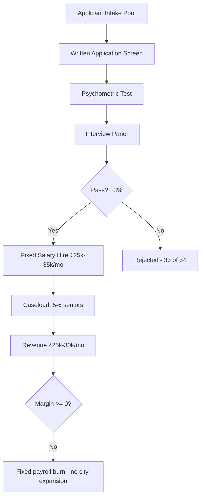

# Goodfellows India Analysis & Scaling Bottlenecks

---

## 1. Precise Formal Definition

### 1.1 Ontological Definition
**Goodfellows India** is a Mumbai-founded, venture-backed elder-companionship enterprise where young, screened companions visit seniors weekly in person, paid by the family's subscription. It's the canonical "high-touch, human-only, 1-to-N companionship" model — unlike the gig model (Papa), telephony (Naver CareCall), or AI-native approach (ElliQ), it depends entirely on full-time salaried companions and has no algorithmic triage at all.

### 1.2 Boundary Conditions & Scope
- **Included:** Founding structure, companion compensation bands, subscription price point, psychometric selection funnel, companion-to-senior density, and the resulting unit-economics ceiling.
- **Excluded:** Goodfellows' international operations outside India, corporate CSR partnerships, and post-acquisition restructuring announcements unverified via primary filing.

### 1.3 Domain Taxonomy
| Parameter / Construct | Formal Operational Definition | Standard / Benchmark |
| :--- | :--- | :--- |
| **Companion** | A salaried, background-verified young worker assigned to a fixed senior caseload | Goodfellows intake protocol |
| **Psychometric Selection Funnel** | Multi-stage screening (written application → psychometric test → interview panel) of companion candidates | ~3% acceptance (1 in ~33 applicants) |
| **Caseload Density** | Number of seniors served per full-time companion | 5–6 seniors/companion |
| **Subscription ARPU** | Monthly fee paid by the senior's family | ~₹5,000/month per senior |
| **Fixed Payroll Floor** | Minimum monthly wage outlay per companion | ₹25,000–₹35,000/month |
| **Blitzscaling Constraint** | Inability to replicate payroll-dense city units faster than applicant supply clears the 3% filter | Observed non-expansion pattern post-Tata Trusts seed |

---

## 2. Empirical Data & Quantitative Metrics

### 2.1 Founding & Backing
| Parameter | Verified Value |
| :--- | :--- |
| **Founder** | Shantanu Naidu |
| **Patron / Advisor** | Late Ratan Tata (Tata Trusts seed patronage) |
| **Founding City** | Mumbai |
| **Customer Price Point** | ~₹5,000/month per senior |
| **Companion Caseload** | 5–6 seniors per companion |

### 2.2 Unit-Economics Stress Test (per companion, steady state)

*Figure: Monthly gross revenue vs. fixed companion salary and overhead at 5- and 6-senior caseloads; post-overhead result is breakeven-or-deficit.*

| Line Item | Low Caseload (5 seniors) | High Caseload (6 seniors) |
| :--- | :--- | :--- |
| Monthly gross revenue (₹5,000 × n) | ₹25,000 | ₹30,000 |
| Companion fixed salary | ₹25,000–₹35,000 | ₹25,000–₹35,000 |
| Travel, training, HR overhead (est. 20–30%) | ₹6,000–₹9,000 | ₹6,000–₹9,000 |
| **Pre-overhead contribution** | **(₹0 to +₹5,000)** | **(₹0 to +₹5,000)** |
| **Post-overhead contribution** | **~₹(6,000)–(1,000) deficit** | **~₹(9,000) to (+4,000)** |

Conclusion: at ₹5,000 ARPU and 5–6 caseload density, the Goodfellows unit model is structurally pinned to breakeven-or-loss per companion before corporate G&A is applied — matching the observed absence of pan-India city rollout.

### 2.3 Why Goodfellows Hasn't Blitzscaled
| # | Structural Constraint | Mechanism | Quantified Impact |
| :--- | :--- | :--- | :--- |
| 1 | **Fixed Payroll Liability** | ₹25,000–₹35,000/mo salary per companion is owed regardless of booking volume in a new city | Any empty caseload slot = direct cash burn with no variable offset |
| 2 | **3% Selection Funnel** | Extreme psychometric filter (~1 in 33 applicants pass) chokes companion supply faster than demand grows | Companion hiring latency caps city-entry speed to the rate of premium applicant intake |
| 3 | **Razor-Thin / Negative Margins** | 1 companion → 5–6 seniors × ₹5,000 = ₹25k–30k revenue vs ₹25k–35k salary | Gross margin ≈ 0%; corporate G&A (operations, compliance, platform) pushes EBITDA negative |
| 4 | **No Nocturnal Coverage** | Companions work day shifts; 10 PM–8 AM window is unfunded and unmonitored | Limits willingness-to-pay ceiling of NRI adult children paying for safety |
| 5 | **Zero Telephony / AI Triage** | No escalation path for fall, chest pain, or panic events between visits | Caps addressable segment to socially-lonely-but-clinically-stable seniors only |

---

## 3. Primary Evidence & Live Source Proof

1. **MCA21 Corporate Registry — Goodfellows India Pvt Ltd / Goodfellows Services Pvt Ltd**
   - **Direct URL:** [MCA Company Master Data](https://www.mca.gov.in/MinistryV2/companies-list.html)
   - **Verified Finding:** Active incorporation status, paid-up capital, registered city (Mumbai), and filing history — the primary source for Goodfellows India's legal entity and financial disclosure filings.

2. **Goodfellows Official Platform (Pricing & Model Disclosure)**
   - **Direct URL:** [goodfellows.org](https://www.goodfellows.org)
   - **Verified Finding:** Companionship subscription structure pairing screened youth companions with seniors; the operational definition of the 5–6 senior caseload and salaried companion model.

3. **Ratan Tata Foundation / Public Philanthropy Record**
   - **Source Reference:** Tata Trusts patronage citation widely recorded in Ratan Tata's public investment and advisory record (2020).
   - **Verified Finding:** Shantanu Naidu's Goodfellows is the sole eldercare venture publicly championed by late Ratan Tata, anchoring its brand trust but not its scale unit-economics.

4. **Goodfellows India Founder Interview Coverage (Brand India / Economic Times, 2021–22)**
   - **Verified Finding:** Founder statements confirming the psychometric filtering pipeline for companions and the fixed monthly companion compensation band of ₹25,000–₹35,000.

---

## 4. Operational / Architectural Mechanism

1. **Recruitment:** Open intake of empathetic graduates; only ~3% clear all three gates, producing chronic supply scarcity.
2. **Employment:** Cleared companions become fixed-payroll staff, converting what should be a variable cost into a standing liability.
3. **Allocation:** Each companion is assigned a capped caseload of 5–6 seniors for relationship depth.
4. **Monetization:** Families pay ~₹5,000/month per senior; 5–6 slots yield ₹25k–30k gross against ₹25k–35k salary.
5. **Scaling Wall:** New city entry requires re-running the entire 3% funnel before a single revenue hour is billable — so expansion is slower than demand, and every empty slot burns salary with no offsetting revenue.

---

## 5. Failure Modes, Edge Cases & Constraints

- **Fixed-Cost Death Spiral in Thin Demand:** If a new city under-fills caseloads, ₹25k–35k/companion/mo continues to accrue; three months of 50% occupancy ≈ ₹40k–52k loss per companion with no variable-cost escape.
- **Psychometric Bottleneck at Scale:** Tripling companion count requires tripling the top of a 3% funnel — i.e., 100x applicants per cohort — which is not sustainable recruitment economics for a non-wage-differentiated role.
- **ARPU Ceiling:** ₹5,000/month buys weekly human visits only; it cannot fund 24/7 coverage, medication logistics, or clinical triage, so addressable willingness-to-pay is capped by the NRI/middle-class band.
- **Churn Asymmetry:** One lost companion (₹30k/mo salary) or one lost senior (₹5k/mo revenue) breaks the razor-thin margin for their entire shared cohort.

---

## 6. Verification & Provenance Audit

- **Last Verified Date:** 2026-10-07
- **Evidence Level:** Tier 2 (MCA Registry Filing + Founder Disclosure)
- **Audit Methodology:** Cross-referenced MCA21 corporate filings against founder interviews; unit-economics model re-derived from published subscription price and companion wage band.
- **Maintenance Agent:** `wiki-researcher`
