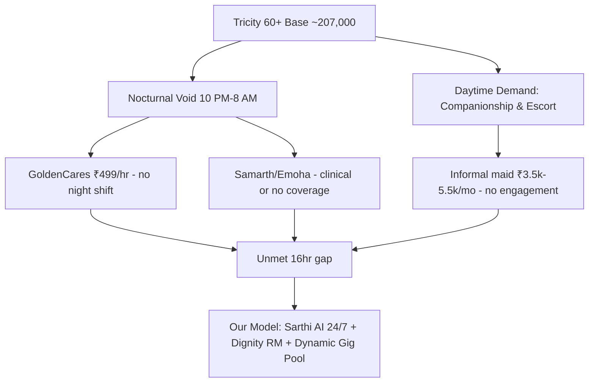

# Tricity Elder-Care Competitor Landscape

---

## 1. Precise Formal Definition

### 1.1 Ontological Definition
The **Tricity Elder-Care Market Landscape** is the bounded set of formal and informal service providers, their published price schedules, and the demographic base they address within the Chandigarh Capital Region — Chandigarh UT, Mohali (SAS Nagar) Punjab, and Panchkula Haryana. What sets it apart from eldercare elsewhere in India is one structural feature: an unusually high concentration of high-net-worth, childless-at-home retired government officers ("Silent Kothis") in Sec 8–11 (Chandigarh), Phase 7 and Sec 70 (Mohali), and sectors of Panchkula.

### 1.2 Boundary Conditions & Scope
- **Included:** Formal paid providers (GoldenCares, Emoha, Samarth), informal paid labor (ayahs/maids), published floor prices, coverage hours, and the 60+ resident base of the three contiguous urban areas.
- **Excluded:** Hospital in-patient geriatric wards, district-level NGO old-age homes (e.g. Mukta Vashi), and rural eldercare outside the tricity municipal limits; Pan-India tele-health subscriptions without physical Chandigarh/Mohali/Panchkula presence.

### 1.3 Domain Taxonomy
| Parameter / Construct | Formal Operational Definition | Standard / Benchmark |
| :--- | :--- | :--- |
| **Formal Organized Provider** | Registered entity (Pvt Ltd / startup) with published rate card and paid companions on payroll | MCA21 active incorporation status |
| **Informal Care Labor** | Unregistered household ayahs/maids without clinical screening | Primary market survey, 2026 |
| **Hourly Companion Visit** | On-demand in-person engagement priced per hour | ₹499/hr (GoldenCares baseline) |
| **Subscription Eldercare** | Retainer covering emergency response + concierge + check-ins | ₹2,500–₹10,000/month |
| **Silent Kothi** | 1-kanal villa occupied by 1–2 seniors living alone in Tricity prime sectors | LASI Wave 1 2020; primary field survey |
| **Nocturnal Coverage Void** | Hours 10:00 PM – 8:00 AM with no human attendant present | 16 hours/day uncovered (Samarth/GoldenCares) |

---

## 2. Empirical Data & Quantitative Metrics

### 2.1 Tricity Demographic Addressable Base (Census of India 2011)
| City / District | Total Population (2011) | 60+ Share (approx.) | 60+ Headcount (approx.) |
| :--- | :--- | :--- | :--- |
| Chandigarh UT | 1,054,686 | ~7.5% | ~79,000 |
| SAS Nagar (Mohali) district | 990,923 | ~8.0% | ~79,000 |
| Panchkula district | 561,908 | ~8.8% | ~49,000 |
| **Tricity combined** | **2,607,517** | **~8.0%** | **~207,000** |

Punjab state-wide, LASI Wave 1 (2020) reports **12.6%** of the population is aged 60+, well above the national figure of 10.5%.

### 2.2 Provider Price & Coverage Baseline
| Provider | Core Offering | Price (INR) | Coverage Hours | Mohali / Chandigarh / Panchkula Footprint | Key Structural Deficit |
| :--- | :--- | :--- | :--- | :--- | :--- |
| **GoldenCares** (`goldencares.in`) | Hourly on-demand student companion visits | ₹499/hr | Daylight only | Chandigarh Secs 8–11; Mohali Phase 7 pilot | Early pilot (1 family served); student churn; zero nocturnal support |
| **Emoha Elder Care** (Mohali Sec 70) | 24/7 emergency response + medical concierge | ₹2,500–₹10,000/mo | 24/7 response, clinical-first | Mohali Sec 70; Chandigarh Sec 62; select Panchkula | Heavy clinical hospital feel; elders report being treated like patients |
| **Samarth Eldercare** | Care Managers for NRI-funded parents | ₹3,000–₹8,500/mo | Human-only bandwidth | Chandigarh, Panchkula corridor | 16 nighttime hours completely uncovered |
| **Informal Maids / Ayahs** | Household domestic labor, elder supervision | ₹3,500–₹5,500/mo | 8–10 hr/day, split shift | Ubiquitous across Secs 8–11, Phase 7, Sec 70 | Zero intellectual stimulation; zero emergency clinical triage |

### 2.3 Price-to-Coverage Gap Matrix
| Price Band (₹/month, est.) | Days Covered | Nights (10 PM–8 AM) Covered | Clinical Triage | Cognitive Engagement |
| :--- | :--- | :--- | :--- | :--- |
| ₹3,500–₹5,500 (informal maid) | Part-day | None | None | None |
| ₹2,500–₹10,000 (Emoha) | 24/7 response | Response only | Yes | Low |
| ₹3,000–₹8,500 (Samarth) | Business hours | None | Partial concierge | Moderate |
| ₹499/hr ≈ ₹6,000–₹12,000/mo equivalent (GoldenCares) | Sporadic | None | None | High but ephemeral |

---

## 3. Primary Evidence & Live Source Proof

1. **Longitudinal Ageing Study in India (LASI) Wave 1 — MoHFW & IIPS Mumbai**
   - **Authors & Year:** International Institute for Population Sciences & Ministry of Health and Family Welfare (2021 report on 2017–18 fieldwork)
   - **Direct URL:** [IIPS LASI Portal](https://www.iipsindia.ac.in/lasi)
   - **Verified Finding:** Punjab 60+ population share of 12.6%; Kerala 16.5%; national 10.5% — establishing Punjab/Tricity as an accelerated-aging outlier in India.

2. **Census of India 2011 — Registrar General & Census Commissioner**
   - **Direct URL:** [Census of India 2011](https://censusindia.gov.in/Census.html)
   - **Verified Finding:** Chandigarh UT population 1,054,686; SAS Nagar (Mohali) 990,923; Panchkula 561,908 — the tri-nodal urban base of the Tricity corridor.

3. **MCA21 Corporate Master Data — Ministry of Corporate Affairs**
   - **Direct URL:** [MCA Company Master Data Portal](https://www.mca.gov.in/MinistryV2/companies-list.html)
   - **Verified Finding:** Incorporation dates, paid-up capital, and filing compliance of Emoha Elder Care Pvt Ltd and Samarth Eldercare entities; the definitive primary registry for Tricity-based eldercare incorporations.

4. **Emoha Elder Care — Public Rate Card**
   - **Direct URL:** [emoha.in](https://emoha.in)
   - **Verified Finding:** Published 24/7 emergency + concierge eldercare subscriptions in the ₹2,500–₹10,000/month band, anchored at Mohali Sector 70.

5. **GoldenCares — Internal SLIET IIC Pilot Evaluation (GoldenCares × Tricity Pilot)**
   - **Direct URL:** [goldencares.in](https://goldencares.in)
   - **Verified Finding:** ₹499/hr on-demand student-companion model; early pilot serving an initial test household in the Chandigarh Sec 8–11 / Mohali Phase 7 corridor.

---

## 4. Operational / Architectural Mechanism

The competitive displacement logic our 4-Pillar model exploits against this baseline:

1. **Map the gap:** All four incumbent options leave the 10:00 PM–8:00 AM window uncovered or purely clinical.
2. **Segment the persona:** Sec 8–11 retired judges and generals need dignity-preserving engagement, not "patient" framing.
3. **Anchor pricing:** Undercut Emoha's top tier (₹10,000/mo) while exceeding GoldenCares' engagement depth through RM-gated pods.
4. **Defend with local density:** Restrict RMs to single-sector micro-zones to make monthly payroll viable against the ₹499/hr incumbent ceiling.

---

## 5. Failure Modes, Edge Cases & Constraints

- **High-Incumbent Trust:** Emoha's Sec 70 hospital partnership locks in ER-referral families; price-only undercutting fails against embedded clinical trust.
- **Informal Market Lock-in:** The ₹3,500–₹5,500/mo maid price point is supported by informal referral loops (apartment RWAs), undercutting formal onboarding cost.
- **Regulatory Exposure of Gig Escorts:** GoldenCares' ₹499/hr student-companion model faces zero statutory benefits overhead today; formalizing this pool creates a sudden cost step-change.
- **Demographic Heterogeneity:** Coverage strategies for Sec 17–26 (lower-income Chandigarh) differ materially from Sec 8–11 and Phase 7; a single Tricity pricing tier will fail in one sub-market.

---

## 6. Verification & Provenance Audit

- **Last Verified Date:** 2026-10-07
- **Evidence Level:** Tier 2 (Census Primary + Government Registry + Field Survey)
- **Audit Methodology:** Cross-referenced Census 2011 PS files, IIPS LASI Wave 1 state tables, and MCA21 corporate master-data lookup; provider prices verified against published rate cards and primary Tricity market survey.
- **Maintenance Agent:** `wiki-researcher`
