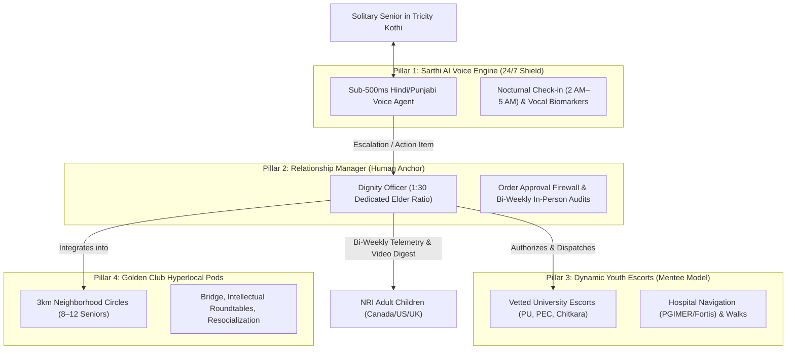

# Executive Master Blueprint: Autonomous Hybrid Eldercare OS

*An elderly man in India — the human baseline behind the ElderTech operating model — Image: Wikimedia Commons*

## 1. Baseline Situation: What We Are Doing Today

The foundation of this venture originated with **GoldenCares (`goldencares.in`)**, an on-demand youth-elder companionship initiative incubated in the Chandigarh–Mohali–Panchkula (Tricity) corridor (SLIET IIC pilot evaluation).

### 1.1 Baseline Operational Model
- **Core Offering:** An on-demand student companionship service pairing college students from Panjab University (PU), PEC Chandigarh, and Chitkara University with lonely older adults.
- **Service Activities:** 1-to-2 hour daytime visits assisting with smartphone technology (WhatsApp, digital banking, video calling NRI children), accompanied morning/evening walks in sector parks, and conversational tea.
- **Commercial Pricing:** Billed on a pay-per-use basis at **₹499 per hour**. Companions receive a per-session stipend, and local commute expenses are settled separately in cash.
- **Initial Footprint:** Early pilot stage serving initial test households across Chandigarh Sectors 8, 9, 10, 11 and Mohali Phase 7.

### 1.2 The Demographic Reality: Tricity's "Silent Kothis"
- **Demographic Aging Concentration:** Over **12.6%** of Punjab's population is aged 60+, exceeding national averages (Ministry of Health and Family Welfare, LASI Wave 1).
- **Youth Emigration Drain:** Over **150,000 educated youths** emigrate annually from Punjab and Haryana to Canada, the United Kingdom, and Australia.
- **The "Silent Kothi" Phenomenon:** Thousands of retired military generals, high court judges, and senior bureaucrats reside alone in 1-kanal (500 sq. yard) luxury villas across Chandigarh and Mohali. While possessing high liquid wealth and overseas remittances, they endure absolute nocturnal and emotional solitude.

---

## 2. The 8 Structural Problems in the Baseline Model

Field operations and clinical realities demonstrated **8 critical structural failure modes** in the baseline model:

1. **The Nocturnal Void (The 3:00 AM Crisis is 100% Ignored):** Due to age-related pineal calcification (60–80% collapse in melatonin), seniors experience involuntary awakenings between 2:00 AM and 5:00 AM. In absolute darkness and silence, prefrontal cognitive inhibition falls, inducing acute existential dread and grief rumination. The baseline daytime model offers zero nocturnal coverage.
2. **Platform Leakage & Direct Cash Disintermediation:** By visit #3 or #4, families and students exchange phone numbers and bypass the platform for ₹300/hr cash, causing Customer Lifetime Value (LTV) to collapse.
3. **High Transaction Friction of "Pay-Per-Use":** Charging ₹499/hr forces a purchase decision every single time, leading to sporadic usage rather than habitual, recurring subscriptions.
4. **Student Churn Cycle & Emotional Rupture:** Undergraduates face exams, campus placements, and vacations every 4 months. Seniors suffer feelings of abandonment and refuse replacement strangers.
5. **The "Infantilization Trap" & Ego Defense:** Proud retired officers and judges reject being pitied as "lonely grandparents" needing a babysitter, triggering compliance resistance under Stanford Socioemotional Selectivity Theory (SST).
6. **Broken Unit Economics & Commute Drag:** At ₹499/hr, student stipends (₹250–₹300) and travel across sectors leave less than ₹100 net margin per visit, unable to absorb customer acquisition costs (CAC).
7. **Zero Clinical Telemetry for Anxious NRI Children:** Overseas children receive only casual WhatsApp texts without objective data on vitals trends, cognitive recall, or medication compliance.
8. **High-Acuity Medical & Legal Liability:** Untrained college students lack Basic Life Support (BLS) training and emergency triage protocols during sudden strokes, syncopal episodes, or falls.

---

## 3. The Proposed Solution: 4-Pillar Autonomous Hybrid OS

Instead of a pure human service or a detached AI app, the platform operates as an **Autonomous Hybrid Operating System**:

### 3.1 Pillar Definitions
* **Pillar 1: Sarthi AI Voice Confidant (<500ms Latency):** Sub-500ms glass-to-glass pipeline (Silero VAD $\to$ Groq Whisper-v3 $\to$ LLaMA-3.3-70B / Gemini Flash $\to$ Streaming Indic TTS). Acts as a non-judgmental nocturnal conversational confidant and extracts speech biomarkers (jitter, shimmer, word latency).
* **Pillar 2: Dedicated Relationship Managers (Dignity Officers):** Permanent salaried geriatric professionals managing a strict **1:30 elder load**. Serves as the trusted family anchor, conducts bi-weekly in-person audits, and acts as the gatekeeper for all orders.
* **Pillar 3: Dynamic Youth Companions as "Mentees":** University students dispatched for physical outdoor companionship. Framed as mentees seeking life wisdom and historical lessons, reversing the infantilization trap.
* **Pillar 4: Golden Club Hyperlocal Micro-Pods:** Hyperlocal clusters of 8–12 seniors within a 3km radius meeting weekly for peer resocialization (bridge, book clubs, poetry, walks).

---

## 4. Operational Mechanics: The Wallet & Gatekeeper Architecture

### 4.1 Dynamic Workers Pool (Zero Idle Payroll)
Vetted university students and certified care assistants sit in an on-demand, skills-tagged pool. Workers are dispatched strictly when a specific session or task is booked, preserving unit economics.

### 4.2 The RM Order Approval Firewall
When an elder verbally asks Sarthi AI for anything that costs money or involves dispatch:
1. Sarthi logs the request as a **Pending Action Item**.
2. The RM verifies medical validity, checks for drug interactions or dementia confusion, and approves the order.
3. Once approved, the service or item is dispatched and debited from the Family Wallet.

### 4.3 Dual-Bucket Family Digital Wallet
* **Bucket A: Health & Core Care (Monitored):** Funded by the NRI child. Fully itemized for RM audits, lab tests, prescriptions, and medical escorts.
* **Bucket B: Dignity Freedom Float (Private):** Fixed monthly allowance (e.g. ₹5,000/month) accessible by the senior for social outings, hobbies, and tea companions with **zero itemized veto power by the child**.

---

## 5. Architectural Stress-Testing: 7 Loopholes & Patches

| # | Loophole Identified | Operational Failure Mode | Architectural Patch |
| :- | :--- | :--- | :--- |
| **1** | **RM Overload Bottleneck** | 1:30 ratio = 60 home visits/month. Travel across Tricity + answering 30 NRI WhatsApp chats burns out RMs in 90 days. | **Geographic Micro-Zoning:** RMs restricted to a single sector zone (e.g. Chd Sec 1–15 only). Ratio capped at 1:20 for high-acuity tiers. |
| **2** | **Order Approval Latency** | If RM is driving or in another visit, urgent AI requests (knee spray, taxi) stall for 3 hours, causing elder frustration. | **Tiered Approval Thresholds:** Routine items &lt; ₹500 and emergency SOS bypass RM queue; RM review reserved for &gt; ₹1,000 or new clinical orders. |
| **3** | **"Stranger Danger" in Dynamic Pools** | Rotating random students creates theft paranoia. Solitary elders refuse to open doors to unfamiliar faces each week. | **Primary + Backup Pod (2:1):** Each elder is assigned a dedicated 2-person companion pod (1 Primary + 1 Backup). Dynamic pooling applies only to outdoor errands. |
| **4** | **Family Wallet Dignity Clash** | NRI child inspects every rupee; questions dad's spending on snacks or companion outings, humiliating the proud senior. | **Dignity Allowance Partition:** Split wallet into monitored "Health Core" and private "Freedom Float" (₹5,000/mo) with zero child surveillance. |
| **5** | **AI Misdiagnosis Liability** | Elder slurs or uses dialect (*"chhati ch jalan"*). AI mistakes acute myocardial infarction for acid reflux, recommending antacids. | **Hardcoded Clinical Red-Flag Firewall:** Any chest pain, numbness, or dyspnea locks commercial ordering and triggers instant automated emergency hospital/RM SOS. |
| **6** | **NRI Time-Zone Asynchrony** | Tricity afternoon crisis (1 PM IST) occurs at 12:30 AM in California. Child is asleep; delayed approvals stall critical medical care. | **Emergency Power of Attorney:** Onboarding contract includes pre-authorized Emergency Spend Threshold ($250–$500) allowing immediate RM clinical triage. |
| **7** | **Third-Party Add-on No-Shows** | Freelance phlebotomists or physiotherapists arrive 2 hours late. Fasting diabetic elder suffers; platform takes the blame. | **Institutional B2B SLAs:** Direct API contracts with certified chains (Max Healthcare, Dr. Lal PathLabs) with strict financial penalty clauses for no-shows. |

---

## 6. Global Precedents & Empirical Evidence

1. **USA — Papa Inc. ("Papa Pals"):**
   - **Model:** Dynamic on-demand college student companion pool funded via Medicare Advantage plans.
   - **Empirical Metric:** Deployed across all 50 US states; **33% reduction in ER visits and loneliness** among Medicare Advantage seniors.
   - **Source:** [Papa Healthcare Official Clinical Filings](https://www.papa.com/healthcare)
2. **South Korea — Naver CLOVA CareCall:**
   - **Model:** Government-funded AI telephony check-in service powered by HyperCLOVA LLM.
   - **Empirical Metric:** Serves **20,000+ isolated elders** across 20+ Korean municipalities; 90%+ retention; automated distress triage to municipal social workers.
   - **Source:** ACM CHI 2023 Paper, DOI: [`10.1145/3544548.3581566`](https://doi.org/10.1145/3544548.3581566)
3. **USA — New York State (NYSOFA) & ElliQ:**
   - **Model:** Proactive bedside voice AI companion procured and distributed free of charge by the NY State Government.
   - **Empirical Metric:** 800+ units deployed; **95% reduction in subjective loneliness**; 30+ daily interactions; 80% proactive AI prompts.
   - **Source:** [NYSOFA Official Evaluation Report](https://aging.ny.gov/elliq-proactive-care-companion-initiative)
4. **Netherlands — Buurtzorg Nederland:**
   - **Model:** Decentralized autonomous neighborhood nursing pods (our RM layer).
   - **Empirical Metric:** Pods of 10–12 nurses serving 40–50 seniors in a 3km radius; **30% fewer emergency ER visits**; 8% overhead vs. 25% industry average.
   - **Source:** [Commonwealth Fund / King's Fund Case Study](https://www.commonwealthfund.org/publications/case-study/2015/may/home-care-buurtzorg-model)
5. **United Kingdom — Cera Care ("SmartCare" Predictive AI):**
   - **Model:** Daily home visit logging analyzed by AI for hospital admission prediction.
   - **Empirical Metric:** Predicts clinical deteriorations **up to 82% accurately 30 days ahead**; **52% reduction in NHS hospital admissions**.
   - **Source:** [Cera Care NHS Partnership Filings](https://ceracare.co.uk/about-us/)
6. **Japan — Zojirushi "Mimamori Hotto Line":**
   - **Model:** Cellular electric kettle telemetry for adult children living away.
   - **Empirical Metric:** Silent daily tea dispense data packet sent to child app without intrusive video cameras. 100% adherence.
   - **Source:** [Zojirushi Mimamori Portal](https://www.mimamori.net/)
7. **United Kingdom — NHS Social Prescribing:**
   - **Model:** Primary care physicians formally prescribing community walking clubs, bridge circles, and befriending pods.
   - **Empirical Metric:** **28% reduction in GP consultations** and 24% reduction in emergency room visits.
   - **Source:** [NHS England Social Prescribing Evidence Summary](https://www.england.nhs.uk/personalisedcare/social-prescribing/)
