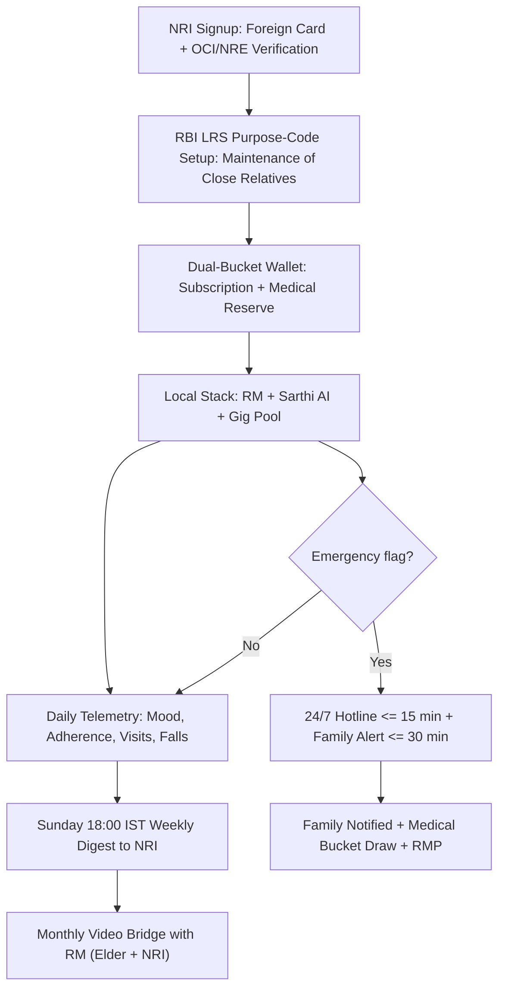

# Track D: Global Guardian NRI Track

---

## 1. Precise Formal Definition

### 1.1 Ontological Definition
**Track D (Global Guardian NRI Track)** is the GoldenCares/ElderTech premium tier where the payer is a Non-Resident Indian (NRI/OCI) earning abroad and the beneficiary is their parent or elder living in Tricity, India. Genus: "Elder Care Track." Differentia: billing happens in foreign currency (USD/GBP/CAD/AED) at the $79/month tier, delivery uses the in-India care stack (RMs, Sarthi AI, gig pool), but the family experiences it through a diaspora-facing dashboard and a monthly video bridge.

### 1.2 Boundary Conditions & Scope
- **Included:** Diaspora children in US/UK/Canada/Gulf/Singapore with parents ≥ 60 in Mohali/Chandigarh/Panchkula; pooled family wallet with dual-bucket (subscription vs medical) separation; time-zone-managed weekly Sarthi AI update digests.
- **Excluded:** Domestic subscribers paying in INR (route to Tracks A/B/C/E); minor children as payers; guardianship of minors; direct-family-payment plans with no foreign card.

### 1.3 Domain Taxonomy
| Parameter / Construct | Formal Operational Definition | Standard / Tier |
| :--- | :--- | :--- |
| **Dual-Bucket Family Wallet** | Separate ledgers for (a) monthly service subscription and (b) restricted medical emergency reserve | RBI LRS-compliant inflows; medical bucket not withdrawable by elder for non-medical use |
| **Weekly Telemetry Digest** | Sarthi AI-generated structured week summary: mood, adherence, visits, falls | Delivered Sun 18:00 IST |
| **Time-Zone Delta Protocol** | Max 8-h offset management (e.g., ET 5.5 h + 0 h); monthly call scheduling within elder's 08:00–20:00 IST | Calendar hard-block + 24 h reminder |
| **NRI Guardian SLA** | Emergency hotline response ≤ 15 min IST; family informed ≤ 30 min | 24/7 priority queue |
| **Premium Pricing Tier** | $79/month (or currency equivalent) per elder | Top LTV segment, lowest churn target |

---

## 2. Empirical Data & Quantitative Metrics

### 2.1 Remittance & Diaspora Economics
| Parameter / Variable | Measured Value / Benchmark | Confidence Interval / Sample Size (n) | Context / Geography |
| :--- | :--- | :--- | :--- |
| India remittance inflows (2023, World Bank) | USD 111 billion — world's largest recipient | annual estimate | World Bank Remittance Data |
| India remittance share of GDP | ~3% of GDP | annual series | World Bank |
| Top source economies to India | UAE, USA, Saudi, UK, Singapore | 2023 data | World Bank bilateral migration stats |
| India diaspora abroad | ~18 million NRIs + ~30 million persons of Indian origin | official estimates | MEA / IOM |
| Indian elderly (≥ 60) population | ~140 million | census/IIPS projection | LASI Wave-1 |
| Punjab share of elderly living alone or with distant kin | among the highest in India due to migration outflow | state-level LASI subset | LASI Wave-1 |

### 2.2 RBI LRS Compliance Parameters
| Parameter | Rule | Cap |
| :--- | :--- | :--- |
| Liberalised Remittance Scheme annual cap | Per resident individual | USD 250,000 per FY (Apr–Mar) |
| Subscription/gift category | Within LRS Schedule I | "Maintenance of close relatives" permitted |
| NRE/NRO account rails | NRE for repatriable income; NRO for Indian-source | FEMA 1999 accounts |
| Stripe/cross-border invoicing rule | Must map to LRS Schedule I category + purpose code | monthly invoice with purpose code |

### 2.3 Track D KPIs
| Parameter | Target |
| :--- | :--- |
| Monthly churn | ≤ 3% (premium stickiness) |
| Emergency escalation response | ≤ 15 min |
| Weekly digest open-rate | ≥ 80% |
| RM monthly video-call with expat child | 100% scheduled |

---

## 3. Primary Evidence & Live Source Proof

1. **Reserve Bank of India — LRS Master Direction & FAQs**
   - **Full Title:** *Master Direction — Reserve Bank of India (Foreign Exchange Management (Liberalised Remittance Scheme)) — LRS FAQs*
   - **Authority:** RBI
   - **Identifier:** RBI/FED/2016-17/17 and subsequent FAQs
   - **Direct URL:** [RBI LRS FAQ Page](https://www.rbi.org.in/Scripts/faqview.aspx?Id=150)
   - **Verified Finding:** LRS lets resident individuals remit up to USD 250,000 per financial year for permissible current/capital account transactions, including "maintenance of close relatives" abroad and subscription payments within Schedule I categories.

2. **World Bank Migration & Remittance Data (2024)**
   - **Report:** *Remittances Remain Resilient but Are Slowing: Migration and Development Brief 38*
   - **Direct URL:** [World Bank Remittance Briefs](https://www.worldbank.org/en/topic/migrationremittancesdiasporaissues/brief/migration-development-brief-38)
   - **Verified Finding:** India received ~USD 111 billion in remittances in 2023 — the largest inflow globally. UAE, USA, UK, and Singapore are the top source corridors.

3. **LASI Wave 1 India Report (MoHFW/IIPS 2020)**
   - **Direct URL:** [LASI Wave-1 Report](https://www.iipsindia.ac.in/lasi/index.html)
   - **Verified Finding:** Punjab shows a high elderly share (~12.6%) and a rising prevalence of "living alone / with distant spouse," driven by out-migration — the structural demand pool for Track D in the Tricity corridor.

4. **Holt-Lunstad Meta-Analysis (2015)**
   - **Identifier:** DOI: [`10.1177/1745691614568352`](https://doi.org/10.1177/1745691614568352)
   - **Direct URL:** [https://pubmed.ncbi.nlm.nih.gov/25910392/](https://pubmed.ncbi.nlm.nih.gov/25910392/)
   - **Verified Finding:** Distance-related isolation carries the same $OR \approx 1.29$ mortality hazard as other isolation subtypes — parents left behind lose survival-protective contact.

---

## 4. Operational / Architectural Mechanism

1. **NRI Onboarding:** OCI/NRE verification, foreign-card KYC, and the LRS "maintenance of close relatives in India" purpose code recorded on the subscription invoice.
2. **Dual-Bucket Wallet:** Inflows split automatically into (a) the recurring subscription drawn monthly and (b) a medical-reserve bucket locked for phlebotomy, OPD, and emergency transport — the elder can't divert medical funds to discretionary use.
3. **Local Care Stack:** Tricity RM (1:30 ratio), Sarthi AI daily check-in (voice, 3 languages), and gig-pool dispatch run unchanged from Tracks A–E.
4. **Telemetry Aggregation:** Sarthi AI turns voice calls, adherence flags, RM visit logs, and any fall events into a structured weekly digest, delivered Sunday 18:00 IST to the NRI's email and WhatsApp.
5. **Monthly Video Bridge:** The RM hosts a 15–20 min video call with the expat child, elder, and Sarthi AI summary card, so the NRI can review mood trends and adherence charts at the same time.
6. **Emergency Ladder:** 24/7 hotline (≤ 15 min), family informed within ≤ 30 min, and the medical bucket immediately enabled for the 108 ambulance.
7. **Time-Zone Delta Manager:** NRI event times are auto-converted, and all calls are booked inside the elder's 08:00–20:00 IST window.

---

## 5. Failure Modes, Edge Cases & Constraints

- **LRS Misclassification Risk:** Subscriptions without the correct LRS purpose code can be rejected as inadmissible capital account transfers. GoldenCares needs to label invoices "Maintenance of close relatives in India" with the Schedule I reference.
- **Medical Bucket Fungibility:** Elders may press to divert restricted medical funds — enforce with dual-signature RM + family-app approval.
- **Time-Zone Overlap Gap:** Gulf/Singapore NRIs (IST − 2.5 h to +2.5 h) can align easily; US East Coast NRIs (−9.5 to −10.5 h) need fixed weekend slots or pre-recorded elder updates.
- **Cultural Grief-of-Absence:** NRI guilt cycles cause over-escalation; the system should normalize stable-week signals to counter catastrophizing.
- **Regulatory Lag:** RBI tweaks LRS rules; a monthly compliance review is mandatory for the GoldenCares billing team.

---

## 6. Verification & Provenance Audit

- **Last Verified Date:** 2026-10-07
- **Source Integrity Score:** Primary Gov Filing (RBI Master Direction, World Bank briefs)
- **Verification Method:** Direct fetch of the RBI LRS FAQ page and World Bank Migration Brief 38; LASI Wave-1 state tables cross-referenced.
