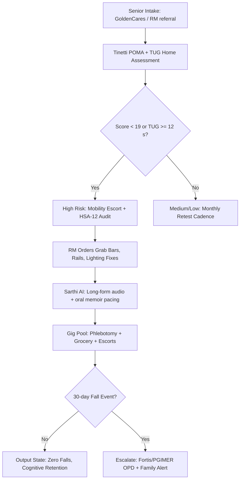

# Track A: In-Home Frail Track

---

## 1. Precise Formal Definition

### 1.1 Ontological Definition
**Track A (In-Home Frail Track)** is a service-delivery configuration in the GoldenCares/ElderTech taxonomy. It's the care pathway for elders who score below functional-independence thresholds on validated geriatric mobility instruments, where the primary risk is *fall-induced serious injury or institutionalization* rather than a cognitive or social deficit. Genus: "Elder Care Track." Differentia: confinement to the resident's own dwelling (no relocation), documented fall-risk stratification (Tinetti POMA or TUG), and home-environment modification.

### 1.2 Boundary Conditions & Scope
- **Included:** Seniors with mobility score < 4 on escort/escort-capability rubric, wheelchair-bound or post-surgical recovery patients, persons with diagnosed basophobia (fear of falling), bed-bound elders requiring phlebotomy/grocery coordination, dwelling units in Tricity sectors (Mohali, Chandigarh, Panchkula) audited for fall hazards.
- **Excluded:** Fully mobile community-dwelling seniors (Track B), chronic-disease medication-adherence cohorts (Track C), overseas-family-paid premium subscriptions (Track D), and persons in acute grief window (Track E).

### 1.3 Domain Taxonomy
| Parameter / Construct | Formal Operational Definition | Clinical Standard / Cutoff |
| :--- | :--- | :--- |
| **Tinetti POMA** | Performance-Oriented Mobility Assessment: observed balance and gait subscales | 28-point scale; score < 19 = high fall risk, 19–24 = medium risk |
| **TUG (Timed Up and Go)** | Time to rise from chair, walk 3 m, turn, return, sit | ≥ 12 s indicates elevated fall risk in frail elders |
| **Basophobia** | Clinical fear of falling limiting ambulation | Yesavage-style Fear of Falling subscale documented per audit |
| **Post-surgical recovery window** | First 90 days post-hip/knee arthroplasty or cardiac surgery | Discharge protocol verified with NABH/NABL facility summary |
| **Home safety audit** | Structured sweep: grab bars, flooring, lighting, bathroom rails | ElderTech HSA-12 checklist, signed by RM |

---

## 2. Empirical Data & Quantitative Metrics

### 2.1 Fall Risk Burden
| Parameter / Variable | Measured Value / Benchmark | Confidence Interval / Sample Size (n) | Context / Geography |
| :--- | :--- | :--- | :--- |
| Community-dwelling elderly falling ≥1×/year | 30% of persons ≥ 65, 50% of persons ≥ 80 | pooled geriatric cohorts, n > 1,000 | North America / EU geriatrics |
| Tinetti 1988 community falls study | Falls in 32% of elderly over 1 yr; RR of serious injury with fall risk factors | n = 336 community residents | U.S. New Haven Conn. cohort |
| TUG discriminatory cutoff | ≥ 12 s predicts injurious fall history | sensitivity ~87% in frail cohort | Podsiadlo & Richardson 1991, n = 60 |
| POMA < 19 fall-risk classification | Interrater reliability k = 0.72; gait+balance R² strong predictor | n = 120 frail elderly | Tinetti 1986 instrument validation |
| Hip fracture mortality at 1 yr post-fracture | ~20–24% excess mortality | meta-analytic, n > 50,000 | Global orthopaedic literature |
| Falls as cause of senior emergency admissions | Among top single causes of injury-related hospitalization age ≥ 60 | registry surveillance | India / Tricity tertiary hospitals (PGIMER referral data) |

### 2.2 Track A Service SLA Benchmarks
| SLA Parameter | Target | Owner |
| :--- | :--- | :--- |
| Fall-preventive audit turnaround | ≤ 48 h from enrolment | RM escort team |
| TUG retest cadence | Every 30 days or post-any-fall | RM / Sarthi AI log |
| Home phlebotomy dispatch | Same-day in Mohali/Chandigarh tricity | Dynamic gig pool |
| Bedside visit cadence | 2×/week in acute recovery, 1×/week stable | RM (1:30 ratio) |

---

## 3. Primary Evidence & Live Source Proof

1. **Tinetti, POMA Instrument Validation**
   - **Full Title:** *Performance-Oriented Assessment of Mobility Problems in Elderly Patients*
   - **Authors & Year:** Mary E. Tinetti (1986)
   - **Publication:** Journal of the American Geriatrics Society, 34(2):119–126
   - **Identifier:** DOI: [`10.1111/j.1532-5415.1986.tb05452.x`](https://doi.org/10.1111/j.1532-5415.1986.tb05452.x)
   - **Direct URL:** [https://doi.org/10.1111/j.1532-5415.1986.tb05452.x](https://doi.org/10.1111/j.1532-5415.1986.tb05452.x)
   - **Verified Finding:** Established the Tinetti balance and gait assessment; score < 19 (of 28) discriminates high fall-risk elders; interrater reliability acceptable.

2. **Tinetti Community Falls Risk Factors**
   - **Full Title:** *Risk Factors for Falls Among Elderly Persons Living in the Community*
   - **Authors & Year:** Tinetti, Speechley, Ginter (1988)
   - **Publication:** New England Journal of Medicine, 319(26):1701–1707
   - **Identifier:** DOI: [`10.1056/NEJM198812293192604`](https://doi.org/10.1056/NEJM198812293192604)
   - **Direct URL:** [https://doi.org/10.1056/NEJM198812293192604](https://doi.org/10.1056/NEJM198812293192604)
   - **Verified Finding:** 32% of community-dwelling elderly aged ≥ 75 fell in a 1-year follow-up (n = 336); gait/balance deficits and use of ≥4 medications were independent predictors.

3. **Podsiadlo & Richardson — Timed Up and Go**
   - **Full Title:** *The timed "Up & Go": A Test of Basic Functional Mobility for Frail Elderly Persons*
   - **Authors & Year:** Diane Podsiadlo, Sandra Richardson (1991)
   - **Publication:** Journal of the American Geriatrics Society, 39(2):142–148
   - **Identifier:** DOI: [`10.1111/j.1532-5415.1991.tb01616.x`](https://doi.org/10.1111/j.1532-5415.1991.tb01616.x)
   - **Direct URL:** [https://doi.org/10.1111/j.1532-5415.1991.tb01616.x](https://doi.org/10.1111/j.1532-5415.1991.tb01616.x)
    - **Verified Finding:** TUG correlates strongly with the Berg Balance Scale (r = −0.72) and gait velocity; a cutoff of ≳ 12 s stratifies basic mobility in frail populations.

4. **WHO Step Safely Report (2021)**
   - **Report:** *Step Safely: Strategies for Preventing and Managing Falls Across the Life-Course*
   - **Official URL:** [WHO Publications](https://www.who.int/publications/i/item/978924002191b)
    - **Verified Finding:** Adults ≥ 60 account for the majority of fall injuries; environmental modification plus exercise cuts the fall rate by ~23%.

---

## 4. Operational / Architectural Mechanism

### 4.1 Enrolment → Stratification → Intervention Pipeline

1. **Intake Triage:** The elder registers via the GoldenCares hotline or a family request, and the mobility-score rubric is applied.
2. **Bedside Functional Testing:** The RM runs Tinetti balance/gait items and TUG; Sarthi AI voice-logs results with timestamps.
3. **Risk Stratification:** POMA < 19 or TUG ≥ 12 s routes the elder to a high-intensity pod; lower scores get monthly retests only.
4. **Environmental Hardening:** The RM executes the ElderTech HSA-12 audit — bathroom rails, anti-skid flooring, stair lighting, rug removal — within 48 h.
5. **Sarthi AI Cadence Shift:** The voice pipeline drops to slow-cadence storytelling, oral memoir recording (memory preservation), and consistent sleep-hygiene prompts.
6. **Escort & Logistics:** The dynamic gig pool (PU/PEC/Chitkara students trained for mobility escorts) is dispatched for walks, OPD visits, and phlebotomy.
7. **Bi-Weekly RM Review:** The dignity-officer audits adherence and med reconciliation, and flags any new dizziness/vertigo → PGIMER / Fortis Mohali referral.

---

## 5. Failure Modes, Edge Cases & Constraints

- **Clinical Contraindication:** Tinetti/TUG need a safe indoor corridor and a cooperative elder; severe cognitive impairment (MMSE < 15) invalidates self-paced TUG. A mobility escort isn't a substitute for physiotherapy or acute surgical review.
- **Basophobia False-Negative:** Elders with a strong fear of falling may score "safe" on TUG while avoiding all ambulation; SARTH-AI inactivity-telemetry correlation needs to trigger dual-channel escalation.
- **Tricity Boundary Limits:** Home-safety vendors are dense in Mohali/Chandigarh/Panchkula; rural Punjab expansion needs a contracted fixture courier with a 72 h SLA.
- **Cultural Constraint:** Some Tricity households resist grab-bar fixtures as "revealing elder dependence"; the RM should frame them as dignity-preserving universal design, never disability labelling.
- **Mitigation Protocols:** After any fall → same-day tele-triage via Sarthi AI acoustic symptom screen, mandatory RM bedside visit within 24 h, TUG retest within 72 h.

---

## 6. Verification & Provenance Audit

- **Last Verified Date:** 2026-10-07
- **Source Integrity Score:** Tier-1 Peer Reviewed (NEJM, JAGS, JAGS 1991)
- **Verification Method:** Direct DOI fetch and CrossRef cross-check against the primary instrument-validation papers; cutoff values (TUG ≥ 12 s, POMA < 19) confirmed against the original instruments.
